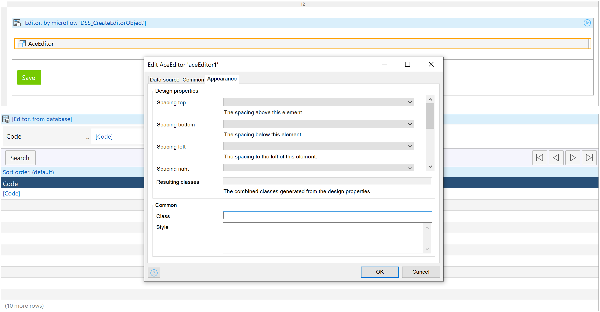
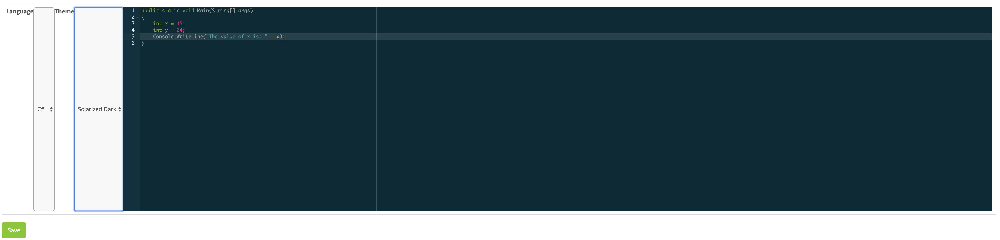

# Use Case, Source Code, and Demo Site
For a weekend project, I wanted to build a nontrivial Mendix widget that required additional NPM packages, interacted with entity attributes, and had internal React state not managed by Mendix entities. Having just used the Ace editor to build a querying environment for my fantasy football league's databases and views, I thought building similar functionality in a Mendix application would be an excellent fit.

The source code is hosted on [GitHub](https://github.com/scottenriquez/mendix-8-ace-editor-widget). I've also included the final `.mpk` file ([version 1.0.2](https://github.com/scottenriquez/mendix-8-ace-editor-widget/blob/master/1.0.2-release/scottiexxx.AceEditor.mpk)) as well. The demo site can be found [here](https://aceeditorwidgettes-sandbox.mxapps.io/index.html?profile=Responsive).

# Prerequisites
Before getting started, you'll need the following installed on your development machine:
- Node.js and NPM
- Yeoman
- Visual Studio Code, WebStorm, or a JavaScript/TypeScript IDE
- Mendix Studio Pro

Since Mendix Studio Pro can only be run on Windows, it's easiest to install the tools above there as well.

# Preparing Your Development Environment
While you can write unit tests for your React components and run via the command line, it's very helpful to test your widget in a real Mendix project as well. Start by creating a blank app, stripping out all existing plugins, and create a folder called `/CustomWidgets` in the `/widgets` folder of your newly created Mendix project. Note that you can create a Git repository in this nested directory for versioning your widget code independently of your Mendix project.

You can generate the skeleton for a Mendix widget using a single command `npm install @mendix/generator-widget -g`. The Yeoman template walks through numerous options including:
- TypeScript or JavaScript
- Web and hybrid or native phone
- Unit tests, end-to-end tests, or none

To build your widget, simply use the command `npm run dev` or `npm run build`. Note that you have to sync the local project directory in Mendix Studio Pro manually by pressing `F4` as well.

# Managing Dependent Attributes and Generating TypeScript Definitions
To create any sort of stateful widget, we need to be able to interact with attributes from our entities. When the widget is scaffolded, an XML file is created in `/src` that allows us to do this. In the root, numerous attributes allow us to express our intentions such as `needsEntityContent` and `offlineCapable`. You can also add `property` tags to designated specific entity attributes required for the widget to function. For example, in the editor widget, the code itself is a required attribute. If you chose TypeScript, the definition file will be generated for you and stored in `/typings` when you run the build command.

# Managing Widget NPM Dependencies
The Yeoman scaffolding creates all widget builds as well. Because of this, adding new dependencies (i.e. the Ace editor) is as simple as another NPM install command: `npm i --save react-ace`. Just like any other Node project, all required packages are documented in the `package.json`.

# Accessing Common Widget Properties
When editing a widget in Mendix Studio Pro, there are a set of common properties that can be passed to widget such as an HTML class, CSS style, and tab index. These are passed to your root component and are accessible out-of-the-box as React props (i.e. `this.props.class`). This allows your widget to utilize the properties in the underlying JSX or TSX in whatever way makes the most sense.


If you elected to use TypeScript, an interface is generated for you as well.

```typescript
interface CommonProps {
	name: string;
	class: string;
	style?: CSSProperties;
	tabIndex: number;
}
```

# Building the Editor Component
The code for the `Editor` component is standard React. Ultimately, [this component](https://github.com/scottenriquez/mendix-8-ace-editor-widget/blob/master/aceEditor/src/components/Editor.tsx) could be easily used in a totally different application on a totally different platform.


# Deploying the Widget
Running the `npm run release` produces an MPK file in the `/dist` folder that can be uploaded easily to the App Store.