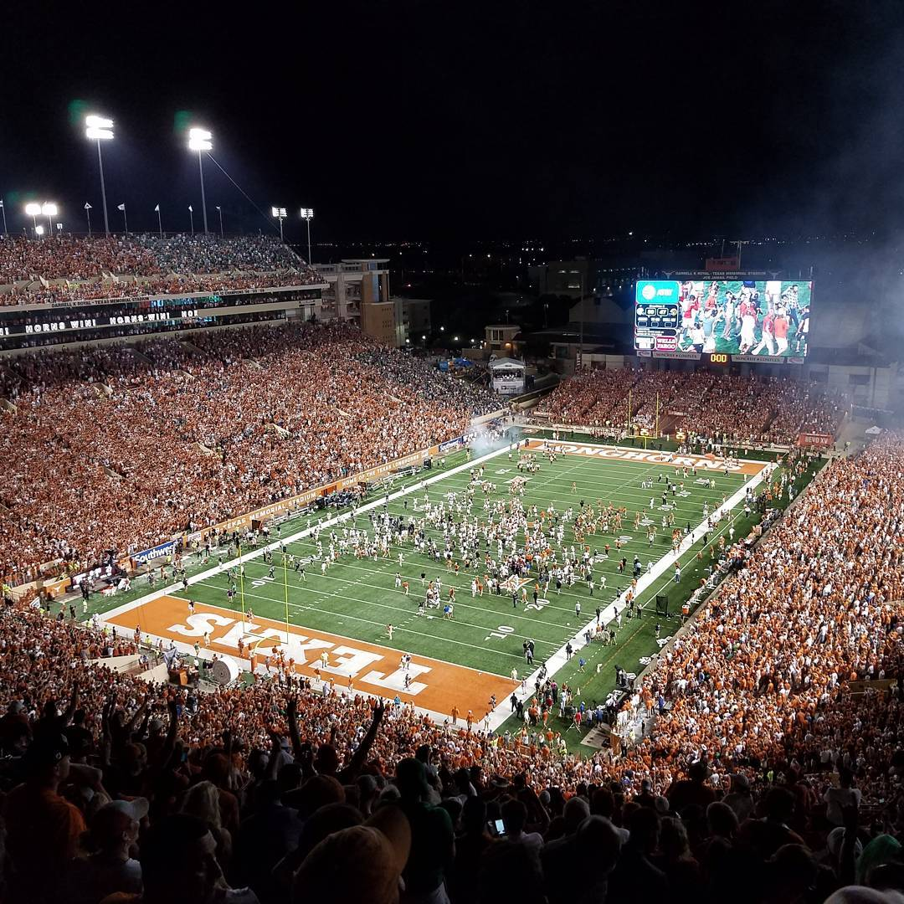

import getGoogleMapsAPIKey from '../../../../src/services/googleMapsAPIKeyService'
import getGoogleMapsOptionsSettings from '../../../../src/services/googleMapsOptionsService'
import GoogleMapReact from 'google-map-react'
import MapMarker from '../../../../src/components/mapMarker'

## The Plan
Before the start of the 2016 college football season, two good friends and I decided to make an epic pilgrimage for the opening weekend. While most games are played on Saturdays, it just so happened that our alma maters played on Friday, Saturday, and Sunday of Labor Day weekend. The three of us all lived in Oklahoma at the time, so we began planning the logistics to see if it would even be physically possible to be at each stadium by kickoff. The match ups were Kansas State at Stanford in Palo Alto, California (for Chris), UCLA at Texas A&M in College Station, Texas (for Callen), and Notre Dame at UT in Austin, Texas (for me). Despite requiring about 4,500 miles of total travel, we determined that it would be possible to see all the games barring any sort of delays. We took a gamble, and this is how it all played out.

## Thursday, September 1st

    <GoogleMapReact
        bootstrapURLKeys={{ key: getGoogleMapsAPIKey() }}
        defaultCenter={{lat: 32.899800, lng: -97.040636}}
        defaultZoom={9}
        options={getGoogleMapsOptionsSettings()}
    >
    <MapMarker lat={32.899800} lng={-97.040636} />
    </GoogleMapReact>

 

The journey began with a five-hour drive from northern Oklahoma to a hotel adjacent to the DFW airport. The three of us had every intention of leaving early to arrive in Dallas at a reasonable hour, but a combination of a forgotten Tyler Lockett jersey and stopping for a GoPro head mount ultimately turned the initial leg of the trip into a six-hour affair. We stumbled into our hotel room well after midnight after making note of a 4:45am shuttle departure to the airport to catch a 6am flight to Oakland. After a few hours of unsatisfying slumber, we packed most of our belongings back into my car, which remained parked at the hotel while we went to the West Coast, and took the essentials with us for a day trip to the Bay Area.

## Friday, September 2nd

    <GoogleMapReact
        bootstrapURLKeys={{ key: getGoogleMapsAPIKey() }}
        defaultCenter={{lat: 37.712384, lng: -122.218832}}
        defaultZoom={9}
        options={getGoogleMapsOptionsSettings()}
    >
    <MapMarker lat={37.712384} lng={-122.218832} />
    </GoogleMapReact>

 

After a short flight with a timezone change in our favor, we landed in Oakland. The game was in the evening, so we had the whole day to kill before kickoff at Stanford Stadium in Palo Alto. Callen’s sister was kind enough to pick us up from the airport and be our hosts for the day. We started off with brunch and drinks in downtown Oakland and a cruise down Telegraph Ave. before heading towards the Bay Bridge. In San Francisco, we picked up some local brews and went to Baker Beach to sprawl out on that sunny, chilly day. After some time of soaking up the majestic views of the Golden Gate and outrageously expensive homes that surround the beach, we stopped at a pub for an early dinner and some strong IPAs. Not long after that, we hailed an Uber for Palo Alto.

| Metric               | Value    |
|----------------------|----------|
| Recorded Attendance  | 46,147   |
| Stadium Capacity     | 50,000   |
| Kansas State AP Rank | Unranked |
| Stanford AP Rank     | 8        |
| Victor               | Stanford |
| Box Score            | 26-13    |
| Overtime             | No       |

Stanford Stadium was much calmer than we all expected. Even during critical moments of the game and watching Christian McCaffrey’s video game moves, the stadium never got particularly loud. The reported attendance was substantially more than the actual number of people at the game. Looking back at our pictures, we could easily see a number of empty seats. To be fair, this game was over Labor Day weekend and classes had not started yet at Stanford. K-State showed out in numbers and proved again that they are one of the best travelling teams.

After the very solid matchup, we took an Uber from Palo Alto back to San Francisco for a red-eye flight back to Dallas-Fort Worth. Our flight didn’t leave until midnight, and we arrived at SFO about an hour and a half early. This was the first time that exhaustion really began to set in. I thought back to how little sleep we started this long day with and how much longer it was going to be before I was able to crash on a comfy bed. We boarded and departed right on time.

## Saturday, September 3rd

    <GoogleMapReact
        bootstrapURLKeys={{ key: getGoogleMapsAPIKey() }}
        defaultCenter={{lat: 30.619470, lng: -96.338035}}
        defaultZoom={9}
        options={getGoogleMapsOptionsSettings()}
    >
    <MapMarker lat={30.619470} lng={-96.338035} />
    </GoogleMapReact>

 

Friday and Saturday blended together. The three of us had to pay back the two hours that we gained from the initial timezone change. This meant that it was 6am when we landed in DFW. None of us really slept on the flight, so we stopped for a hearty breakfast at Whataburger, a staple restaurant of Texas. Kickoff for the Texas A&M game was at 2:30pm, so we had plenty of time to make the three-hour drive to College Station. After several stops, we arrived at our hotel at around 11am. As exhausted as I was at this point, I felt completely refreshed after brushing my teeth and a quick shower even though I didn't have time for a nap. After a quick lunch at the Buffalo Wild Wings next door, we took an Uber to the stadium.

| Metric              | Value     |
|---------------------|-----------|
| Recorded Attendance | 100,443   |
| Stadium Capacity    | 102,733   |
| Texas A&M AP Rank   | Unranked  |
| UCLA AP Rank        | 16        |
| Victor              | Texas A&M |
| Box Score           | 31-24     |
| Overtime            | 1OT       |

As much as it pains me as a Longhorn to say, the A&M gameday vibe was impressive. The atmosphere of this game was staggering especially compared to the game in the Bay Area the day before. Before the game several fighter jets flew overhead. Each of the 100,000 people in the stadium made their presence known. It didn’t help the situation at all that UCLA quarterback Josh Rosen made a comment beforehand that "after 50,000 it all sounds the same." This incited several chants. In true A&M fashion, they did their best to lose the game after securing an early lead. The 4th quarter was dominated by UCLA, but A&M secured an overtime win with a touchdown from a quarterback run. It was awesome to see the crowd’s reaction, although I outright refused to sing the A&M fight song, which is almost entirely about the University of Texas.

As much as I would have liked to check out the local scene, we ate Buffalo Wild Wings again after the game then promptly passed out.

## Sunday, September 4th

    <GoogleMapReact
        bootstrapURLKeys={{ key: getGoogleMapsAPIKey() }}
        defaultCenter={{lat: 30.283983, lng: -97.732759}}
        defaultZoom={9}
        options={getGoogleMapsOptionsSettings()}
    >
    <MapMarker lat={30.283983} lng={-97.732759} />
    </GoogleMapReact>

 

After the first full night’s sleep in a few days, we drove to Austin. The three of us met up with other friends and ate some amazing breakfast tacos from Juan in a Million, then walked around campus. Touring my alma mater made me incredibly nostalgic, but hanging out at a pre-game house party made me feel incredibly old. After drinks and a barbecue, we made the trek to Darrell K. Royal Stadium.

| Metric              | Value    |
|---------------------|----------|
| Recorded Attendance | 102,315  |
| Stadium Capacity    | 100,119  |
| Texas AP Rank       | Unranked |
| Notre Dame AP Rank  | 10       |
| Victor              | Texas    |
| Box Score           | 50-47    |
| Overtime            | 2OT      |

This game was an emotional rollercoaster ride. As a fan, I had extremely low expectations after an embarrassing loss last year in South Bend. The Irish came out of the gate strong with a touchdown on their opening drive, and I could feel the energy draining from the record-setting crowd. After their kicking unit left the field, Texas was about to have our answer as to who our starting quarterback was going to be. The energy came back immediately when true freshman Shane Buechele took the field. It peaked when he completed his first pass as a college quarterback and finished the opening drive off with a perfectly placed touchdown ball.

Momentum shifted back and forth between the two teams all night long. Texas seemed to be coming out on top when an extra point that should have sealed the game was returned for two points by Notre Dame after a special teams mishap. The game entered overtime. Then a second overtime brought the game to a climactic close with Tyrone Swoopes diving into the endzone for the win. As insane as the crowd went in that moment, what still gives me chills to think about is the 100,000 people singing The Eyes of Texas when it was all over.