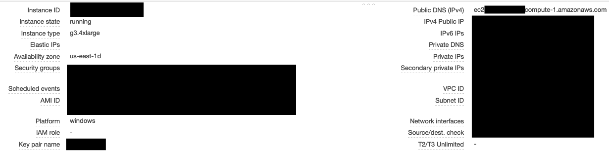
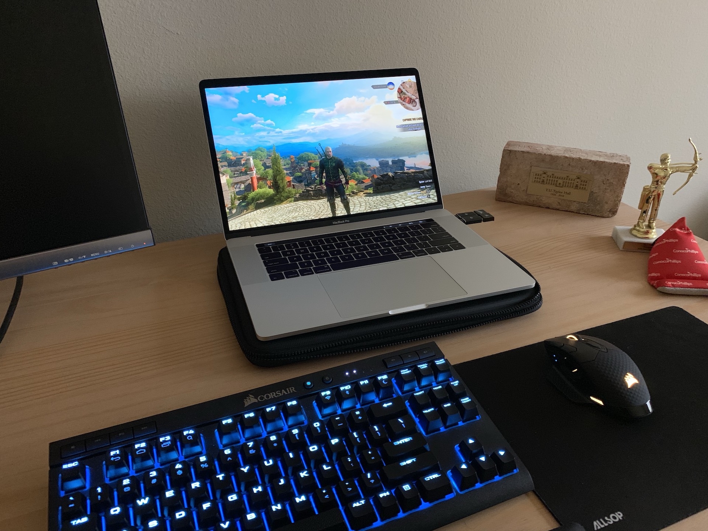

# The Idea
For a quick weekend project, I wanted to see how feasible setting up a cloud gaming rig would be. Using EC2 from AWS and about $10 USD, I was able to get a proof of concept set up and several games installed and running. I did run into a few issues that this post should address how to get around.

# Choosing an AMI
An Amazon Machine Image is a virtual appliance used to create a virtual machine in EC2. These VMs span a variety of purposes and use a *NIX or Windows operating system. You can create your own AMIs, use community-provided AMIs, or subscribe to one from the AWS Marketplace. It’s worth noting that the last option tacks on an additional hourly cost in addition to the base EC2 computing costs. In the interest of time, I opted to start with [a marketplace AMI specifically purposed for gaming](https://aws.amazon.com/marketplace/pp/Amazon-Web-Services-Microsoft-Windows-Server-2016-/B07612M5P7) with the requisite graphics drivers preinstalled.

# Launching an Instance
Per the AMI’s recommendation, I provisioned a `g3.4xlarge` EC2 instance. As you might expect from an instance that carries a nearly $2 USD/hour price tag, the resources are quite powerful: 16 vCPUs, 122 GiB RAM, and an NVIDIA Tesla GPU. Most of the default settings should work, but be sure to provision an SSD larger than the default 30 GB given that most AAA games now are nearly twice that in size.

Always remember to shut the server down when you’re not using it and verify that it’s instance state is listed as stopped in your EC2 console. I would highly recommend configuring a billing alarm to avoid surprising charges, as well as configuring your EC2 instance to stop when you shut down.

# Connecting to the EC2 Instance
Once the instance has been provisioned, you can connect to it via RDP. For macOS users, you can download Microsoft Remote Desktop 10 via the App Store. If you configured a key pair when launching your VM, download and locate the `.pem` file. In order to log into your new server, you’ll need the password for Administrator as well as the public hostname. To obtain the password, simply right-click on the instance and choose Get Windows Password and provide the private key if need be. To obtain the public hostname, simply refer to the description tab beneath the running instance. You can also download a Remote Desktop (`.rdp`) file via the right-click menu.

# Initial Configuration and Installing Software
Windows Server 2016 is a highly stripped-down version of Windows 10. You’ll notice that the only browser installed is Internet Explorer running in Enhanced Security mode. I’d highly recommend starting by disabling this mode or installing Google Chrome. You’ll also need to enable some services that aren’t turned on by default. Via the Server Manager, start by enabling the WLAN service and .NET Frameworks. You’ll also need to enable sound as well.

I wanted to see how well such a powerful VM could run a graphically intensive game, so I chose The Witcher 3. In addition to downloading the game and Steam, I also installed the GeForce Experience app from NVIDIA to ensure that my graphics drivers were the latest available. Assuming that you chose the same AMI that I did, the latest drivers should already be pre-installed.

# Running Games
After doing all of the setup above, I received D3D errors from every game that I tried to run. I was able to get past this error by running the game in windowed mode or specifying a resolution via the launch options: `-windowed` or `-h 1920 -w 1080`.

# Tweaking Your Settings
I was able to get solid performance on both my MacBook’s Retina Display as well as a standard 1080p monitor. Never having done anything graphically intensive on a Windows VM, I wasn’t aware that you can’t change your resolution from the VM itself. Rather, configuration needs to be done via your RDP client. As you probably expect, these settings are heavily dependent on the display that you’re playing on.

It’s also worth noting that unless you provision an Elastic IP Address, your public hostname and IP will change every time you start and stop the EC2 instance. This means that if you don’t have a static IP address in place, you’ll need to either download a fresh .rdp file or update your hostname in the RDP client constantly.

# Latency and Limitations
I was able to play The Witcher 3 with bearable latency though I don’t know that this setup would be feasible for multiplayer or competitive gaming. Per the AMI’s documentation, the streaming limit is 1080p with 30 frames per second. This means that while the VM is powerful enough to achieve higher FPS at a higher resolution, the bottleneck will ultimately be its streaming bandwidth.

