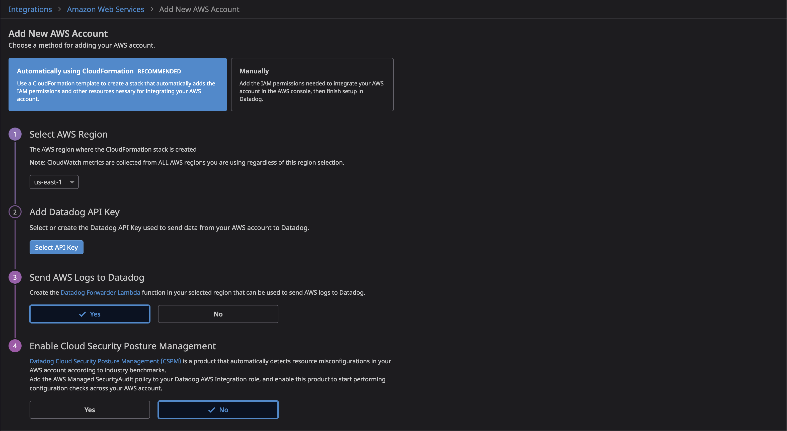
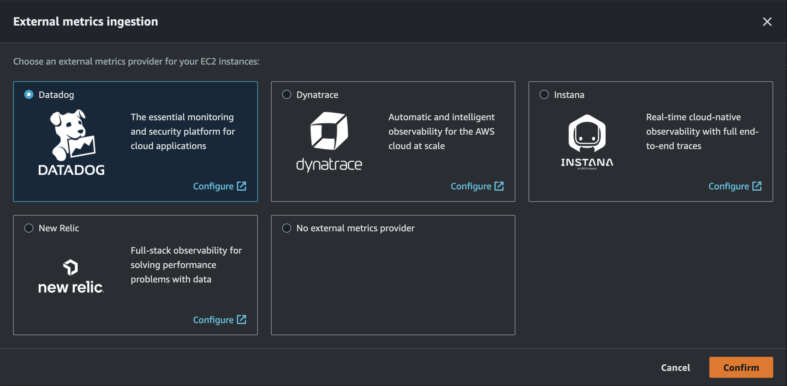
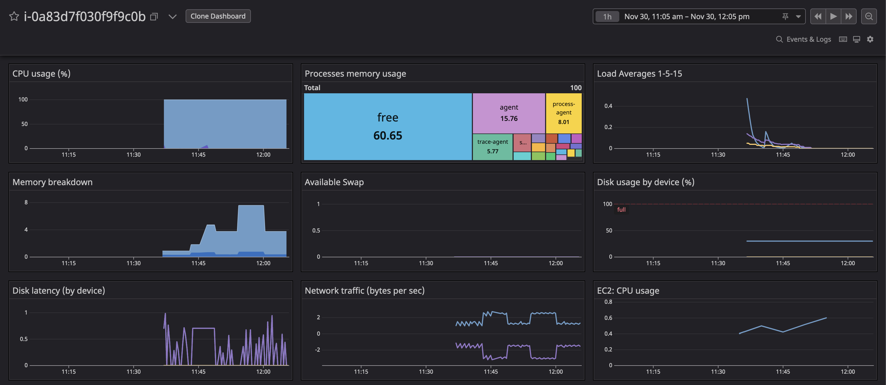
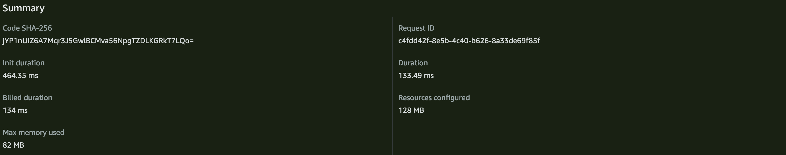
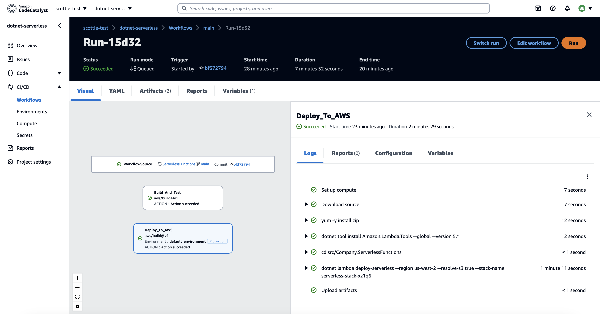
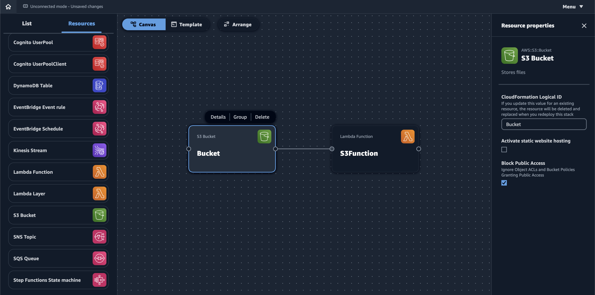
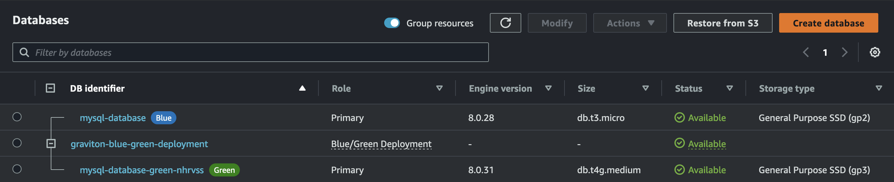
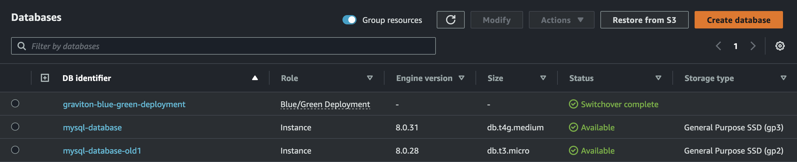
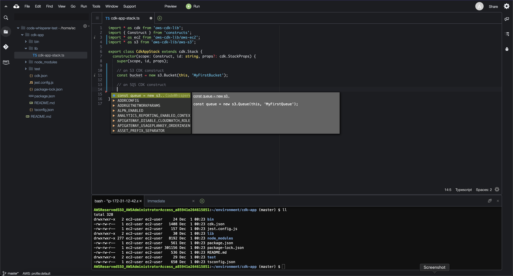

## Overview

I learn best by doing, so with every release cycle,  I take the time to build fully functional examples and digest the blog posts and video content. Below are some of my favorite releases from re:Invent 2022. You can find all source code in [this GitHub repository](https://github.com/scottenriquez/reinvent-2022-examples).

## Compute Optimizer Third-Party Metrics

Compute Optimizer is a powerful and free offering from AWS that analyzes resource usage and provides recommendations. Most commonly, it produces rightsizing and termination opportunities for EC2 instances. However, in my experience, the most significant limitation for customers is that Compute Optimizer does not factor memory or disk utilization into findings by default. As a result, AWS customers that use CloudWatch metrics have their findings enhanced, but other customers often use third-party alternatives to capture memory and disk utilization. AWS announced [third-party metric support for Compute Optimizer](https://aws.amazon.com/blogs/aws-cloud-financial-management/aws-compute-optimizer-launches-integration-with-application-performance-monitoring-and-observability-partners/), including Datadog.

To test this new feature, we need a few things:
- Compute Optimizer enabled for the proper AWS account(s)
- Datadog AWS integration enabled
- An EC2 instance (i.e., candidate for rightsizing) with the Datadog agent installed

First, [opt in to Compute Optimizer](https://aws.amazon.com/compute-optimizer/getting-started/) in your AWS account. Next, enable [AWS integration](https://docs.datadoghq.com/integrations/amazon_web_services/) in your Datadog account. This can be done in an automated fashion via a CloudFormation stack. It's also worth noting that Datadog offers a [14-day free trial](https://www.datadoghq.com/free-datadog-trial/).



Back in the AWS Console for Compute Optimizer, select Datadog as an external metrics ingestion source.



Lastly, we need to deploy an EC2 instance. The following CDK stack creates a VPC, EC2 instance (`t3.medium`; be aware of charges) with the Datadog agent installed, security group, and an IAM role. Before deploying the stack, be sure to set `DD_API_KEY` and `DD_SITE` environment variables. The EC2 instance, role, and security group are also configured for Instance Connect.

```typescript
export class Ec2InstanceWithDatadogStack extends cdk.Stack {
  constructor(scope: Construct, id: string, props?: cdk.StackProps) {
    super(scope, id, props);

    // networking
    const vpc = new ec2.Vpc(this, 'VPC', {
      ipAddresses: ec2.IpAddresses.cidr('10.0.0.0/16'),
      natGateways: 0
    });
    const selection = vpc.selectSubnets({
      // using public subnets as to not incur NAT Gateway charges
      subnetType: ec2.SubnetType.PUBLIC
    });
    const datadogInstanceSecurityGroup = new ec2.SecurityGroup(this, 'datadog-instance-sg', {
      vpc: vpc,
      allowAllOutbound: true,
    });
    // IP range for EC2 Instance Connect
    datadogInstanceSecurityGroup.addIngressRule(ec2.Peer.ipv4('18.206.107.24/29'), ec2.Port.tcp(22), 'allow SSH access for EC2 Instance Connect');

    // IAM
    const datadogInstanceRole = new iam.Role(this, 'datadog-instance-role', {
      assumedBy: new iam.ServicePrincipal('ec2.amazonaws.com'),
      managedPolicies: [
        iam.ManagedPolicy.fromAwsManagedPolicyName('EC2InstanceConnect'),
      ],
    });

    // EC2 instance
    const userData = ec2.UserData.forLinux();
    userData.addCommands(
      'sudo yum install ec2-instance-connect',
      // set these environment variables with your Datadog API key and site
      `DD_API_KEY=${process.env.DD_API_KEY} DD_SITE="${process.env.DD_SITE}" bash -c "$(curl -L https://s3.amazonaws.com/dd-agent/scripts/install_script_agent7.sh)"`,
    );
    const ec2Instance = new ec2.Instance(this, 'ec2-instance', {
      vpc: vpc,
      vpcSubnets: {
        subnetType: ec2.SubnetType.PUBLIC,
      },
      role: datadogInstanceRole,
      securityGroup: datadogInstanceSecurityGroup,
      // note: this will incur a charge
      instanceType: ec2.InstanceType.of(
        ec2.InstanceClass.T3,
        ec2.InstanceSize.MEDIUM,
      ),
      machineImage: new ec2.AmazonLinuxImage({
        generation: ec2.AmazonLinuxGeneration.AMAZON_LINUX_2,
      }),
      userData: userData
    });
  }
}
```

Once successfully deployed, metrics for the EC2 instance will appear in your Datadog account.



Finally, wait up to 30 hours for a finding to appear in Compute Optimizer with the proper third-party APM metrics.

## AWS Lambda SnapStart
Cold starts are one of the most common drawbacks of serverless adoption. Specific runtimes, such as Java, are more affected by this, especially in conjunction with frameworks like Spring Boot. [SnapStart](https://aws.amazon.com/blogs/compute/starting-up-faster-with-aws-lambda-snapstart/) aims to address this:

> After you enable Lambda SnapStart for a particular Lambda function, publishing a new version of the function will trigger an optimization process. The process launches your function and runs it through the entire `Init` phase. Then it takes an immutable, encrypted snapshot of the memory and disk state, and caches it for reuse. When the function is subsequently invoked, the state is retrieved from the cache in chunks on an as-needed basis and used to populate the execution environment. This optimization makes invocation time faster and more predictable, since creating a fresh execution environment no longer requires a dedicated `Init` phase.

For now, SnapStart only supports the Java runtime.

With the release came support via CloudFormation and CDK. However, at the time of writing, CDK only supports SnapStart via the [L1 construct](https://docs.aws.amazon.com/cdk/api/v2/docs/aws-cdk-lib.aws_lambda.CfnFunction.html): `CfnFunction`. The [L2 `Function` class](https://docs.aws.amazon.com/cdk/api/v2/docs/aws-cdk-lib.aws_lambda-readme.html) does not yet have support, so this may be a temporary blocker for CDK projects. Using CDK, I wrote a simple stack to test a trivial function:

```typescript
export class Java11SnapstartLambdaStack extends cdk.Stack {
  constructor(scope: Construct, id: string, props?: cdk.StackProps) {
    super(scope, id, props);
    // artifact bucket and ZIP deployment
    const artifactBucket = new s3.Bucket(this, 'ArtifactBucket');
    const artifactDeployment = new s3Deployment.BucketDeployment(this, 'DeployFiles', {
      sources: [s3Deployment.Source.asset('./artifact')],
      destinationBucket: artifactBucket,
    });

    // IAM role
    const lambdaExecutionRole = new iam.Role(this, 'LambdaExecutionRole', {
      assumedBy: new iam.ServicePrincipal('lambda.amazonaws.com'),
    });
    lambdaExecutionRole.addManagedPolicy(iam.ManagedPolicy.fromAwsManagedPolicyName('service-role/AWSLambdaBasicExecutionRole'));
    
    // Lambda functions
    const withSnapStart = new lambda.CfnFunction(this, 'WithSnapStart', {
      code: {
        s3Bucket: artifactDeployment.deployedBucket.bucketName,
        s3Key: 'corretto-test.zip'
      },
      functionName: 'withSnapStart',
      handler: 'example.Hello::handleRequest',
      role: lambdaExecutionRole.roleArn,
      runtime: 'java11',
      snapStart: { applyOn: 'PublishedVersions' }
    });
    const withoutSnapStart = new lambda.CfnFunction(this, 'WithoutSnapStart', {
      code: {
        s3Bucket: artifactDeployment.deployedBucket.bucketName,
        s3Key: 'corretto-test.zip'
      },
      functionName: 'withoutSnapStart',
      handler: 'example.Hello::handleRequest',
      role: lambdaExecutionRole.roleArn,
      runtime: 'java11'
    });
  }
}
```

In [Jeff Barr's post](https://aws.amazon.com/blogs/aws/new-accelerate-your-lambda-functions-with-lambda-snapstart/), he used a Spring Boot function and achieved significant performance benefits. Next, I wanted to see if there were any benefits to a barebones Java 11 function, given that there is no additional charge for SnapStart. With a few tests, I reproduced a slight decrease in total duration. 

Cold start without SnapStart (577.84 milliseconds):


Cold start with SnapStart (537.94 milliseconds):


A few cold start tests are hardly conclusive, but I'm excited to see how AWS customers' performance and costs fare at scale. One thing to note is that in both my testing and the Jeff Barr example, the billed duration increased with SnapStart while the total duration decreased (i.e., this may be faster but come with an indirect cost).

## AWS CodeCatalyst

I started my career as a .NET developer writing C#. My first experience with professional software development involved using Team Foundation Server. Even as a consultant focused on AWS about a year ago, many customers I worked for primarily used Azure DevOps to manage code, CI/CD pipelines, etc. While it may seem strange to use a Microsoft tool for AWS, the developer experience felt more unified than AWS CodeSuite in my opinion. CodeCommit, CodeBuild, and CodePipeline feel like entirely separate services within the AWS Console. While they are easily integrated via automation like CloudFormation or CDK, navigating between the services in the UI often takes several clicks.

Enter CodeCatalyst. In addition to the [release blog post](https://aws.amazon.com/blogs/aws/announcing-amazon-codecatalyst-preview-a-unified-software-development-service/), there is an excellent [AWS Developers podcast episode](https://soundcloud.com/awsdevelopers/episode-061-announcing-amazon-codecatalyst-with-harry-mower-and-doug-clauson) outlining the vision for the product. I'm paraphrasing, but these are the four high-level problems that CodeCatalsyt aims to solve in addition to the feedback above:
- Setting up the project itself
- Setting up CI/CD
- Setting up infrastructure and environments
- Onboarding new developers

CodeCatalyst does not live in the AWS Console. It's a separate offering that integrates via Builder ID authentication. While CodeCatalyst can be used to create resources that reside in an account (i.e., via infrastructure as code), the underlying repositories, pipelines, etc. that power the developer experience are not exposed to the user. In addition to this, the team recognized that many customers have at least some of the tooling in place that CodeCatalyst provides. As such, it supports third-party integration for various components (e.g., Jira for issues, GitHub for a repository, GitHub Actions for CI/CD, etc.).

One of the most compelling features of CodeCatalyst is blueprints. Blueprints aim to provide fully functional starter kits encapsulating useful defaults and best practices. For example, I chose the .NET serverless blueprint that provisioned a Lambda function's source code and IaC in a Git repository with a CI/CD pipeline.



## AWS Application Composer Preview

Application Composer is a new service from AWS that allows developers to map out select resources using a GUI with the feel of an architecture diagram. These resources can be connected to one another (e.g., an EventBridge Schedule to trigger Lambda). A subset of attributes can also be modified, such as the Lambda runtime.



While the creation process is UI-driven, the output is a SAM template (i.e., a CloudFormation template with a `Transform` statement). For example, the diagram above creates the following:

```yaml
Transform: AWS::Serverless-2016-10-31
Resources:
  Bucket:
    Type: AWS::S3::Bucket
    Properties:
      BucketName: !Sub ${AWS::StackName}-bucket-${AWS::AccountId}
      BucketEncryption:
        ServerSideEncryptionConfiguration:
          - ServerSideEncryptionByDefault:
              SSEAlgorithm: aws:kms
              KMSMasterKeyID: alias/aws/s3
      PublicAccessBlockConfiguration:
        IgnorePublicAcls: true
        RestrictPublicBuckets: true
  BucketBucketPolicy:
    Type: AWS::S3::BucketPolicy
    Properties:
      Bucket: !Ref Bucket
      PolicyDocument:
        Id: RequireEncryptionInTransit
        Version: '2012-10-17'
        Statement:
          - Principal: '*'
            Action: '*'
            Effect: Deny
            Resource:
              - !GetAtt Bucket.Arn
              - !Sub ${Bucket.Arn}/*
            Condition:
              Bool:
                aws:SecureTransport: 'false'
  S3Function:
    Type: AWS::Serverless::Function
    Properties:
      Description: !Sub
        - Stack ${AWS::StackName} Function ${ResourceName}
        - ResourceName: S3Function
      CodeUri: src/Function
      Handler: index.handler
      Runtime: nodejs18.x
      MemorySize: 3008
      Timeout: 30
      Tracing: Active
      Events:
        Bucket:
          Type: S3
          Properties:
            Bucket: !Ref Bucket
            Events:
              - s3:ObjectCreated:*
              - s3:ObjectRemoved:*
  S3FunctionLogGroup:
    Type: AWS::Logs::LogGroup
    DeletionPolicy: Retain
    Properties:
      LogGroupName: !Sub /aws/lambda/${S3Function}
```

This service has the potential to offer the best of both worlds: an easy-to-use GUI and a deployable artifact. There's a clear focus on serverless design for now, but I'd like to see if this expands to other areas (e.g., VPC design). It's also worth noting that Application Composer utilizes the browser's file API for Google Chrome and Microsoft Edge to save the latest template changes locally. I'd love to see CDK L2 construct support here in addition to CloudFormation also.

## Amazon RDS Managed Blue/Green Deployments

> When updating databases, using a blue/green deployment technique is an appealing option for users to minimize risk and downtime. This method of making database updates requires two database environments: your current production environment, or blue environment, and a staging environment, or green environment.

I find [this release](https://aws.amazon.com/blogs/aws/new-fully-managed-blue-green-deployments-in-amazon-aurora-and-amazon-rds/) particularly valuable, given that many AWS customers are trying to maximize their use of Graviton for managed services, including RDS. Graviton processors are designed by AWS and achieve significant price-performance improvements. They also offer savings versus Intel chips. Typically, the adoption of Graviton for EC2 is a high-lift engineering activity since code and dependencies must support ARM. However, with managed services, AWS handles software dependency management. This makes RDS an excellent candidate for Graviton savings. Due to the stateful nature of databases, changes introduce additional risks. Blue/Green Deployments mitigate much of this risk by having two fully functional environments coexisting.

To test this feature, I provisioned a MySQL RDS instance with an older version on an Intel instance with a previous-generation general-purpose SSD. A Blue/Green Deployment can then be created via the Console and CLI, which spawns a second instance. I then modified the Green instance to use `gp3` storage, a Graviton instance type (`db.t4g.medium`), and the latest version of MySQL.



Once the Green instance modifications were finished, I then switched over the instances.



## Amazon CodeWhisperer Support for C# and TypeScript
CodeWhisperer, Amazon's response to GitHub Copilot, is described as an ML-powered coding companion. I had yet to test the preview, but [this release](https://aws.amazon.com/about-aws/whats-new/2022/11/amazon-codewhisperer-enterprise-controls-sign-up-new-languages/) is relevant to me, given I write mostly TypeScript and C# these days. Moreover, TypeScript is particularly interesting to the cloud community, given that it is the de facto standard for CDK as the first language supported. CodeWhisperer is available as part of the AWS Toolkit for Visual Studio Code and the JetBrains suite, but I opted to give it a test run in Cloud9, AWS's cloud-based IDE.



CodeWhisperer is proficient at generating code against the AWS SDK, such as functions to stop an EC2 instance or fetch objects from an S3 bucket. With regards to CDK, it generated simple constructs sufficiently for me. However, CodeWhisperer tended to generate recommendations line-by-line instead of in large blocks for larger and more complex constructs. In addition, the recommendations seemed to be context-aware (i.e., recommending valid properties and methods based on class definitions). These two use cases alone provide a great deal of opportunity since most of the time I spend writing code with AWS SDK and CDK tends to be spent reading documentation.