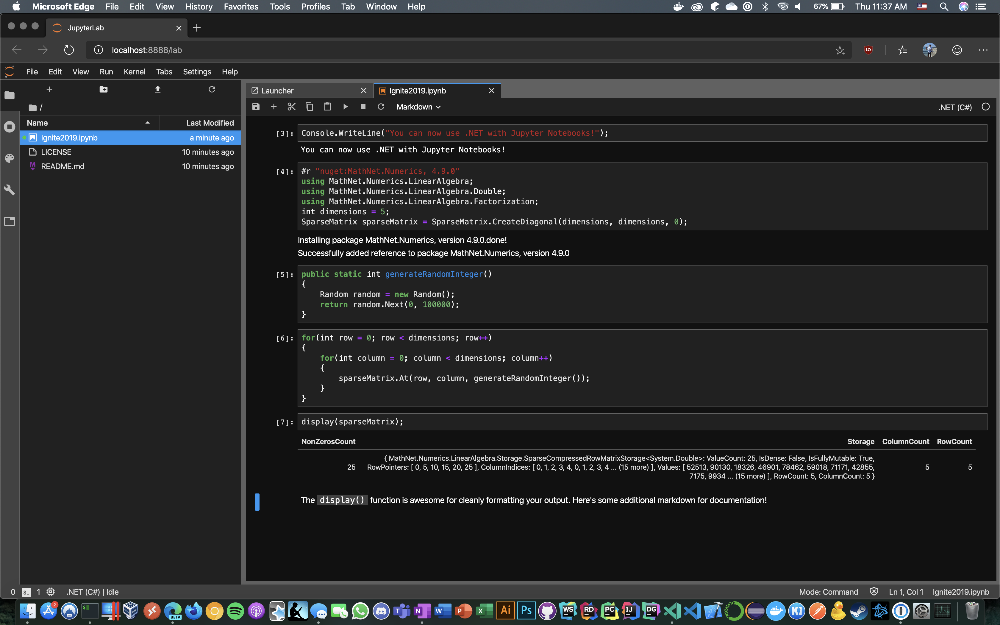

# Contents
- .NET 5: The Future
- Unique Azure Functions Features
- Microsoft Edge Chromium
- .NET Support for Jupyter Notebooks

# .NET 5: The Future
.NET Core 3.1 will be released in December 2019 as a minor release focusing on enhancements to Blazor and desktop development. As for a .NET roadmap, Scott Hanselman and Scott Hunter also mentioned that there will not be a .NET Core 4.x release. The underlying idea is that it would collide with the well-known 4.x .NET Framework versions that still have widespread production use to this day. Starting in November 2020, there will no longer be .NET Core or Framework, but instead, they will merge into a unified platform simply known as .NET 5. Each November a new major version of .NET will be released (i.e. .NET 6 in 2021, .NET 7 in 2022, etc.).

The message around .NET Framework versus .NET Core remains the same: there's not an imperative need to migrate all .NET Framework projects to .NET Core, however, .NET Framework should not be used for any new projects going forward. Windows will continue to ship with .NET Framework, and .NET Core continues to expand its self-contained offerings (i.e. .NET Core 3.0 adding the ability to build an executable with the runtime included).

# Unique Azure Function Features
My expertise is in AWS, so I figured that I'd note a couple of key features that Azure Functions offer in the serverless space not available in Lambda. The first is the ability to deploy containers as serverless functions. While you can create similar functionality using Fargate, it's awesome to see this function built into Microsoft's serverless offering.

It's easy to stand up a new Azure Function with full Docker support in just a few minutes. Start by installing the Azure Functions CLI tools via NPM with the command `npm install -g azure-functions-core-tools` and creating a function with Docker support using `func init --docker --force`. The latter command will create a new .NET project as well as a Dockerfile. Run `func new` to select from a list of starter templates for your new Azure Function. You now have a scaffolded function for a number of use cases such as an HTTP trigger, CosmosDB trigger, or Event Grid trigger.

We're now ready to build and run using the CLI by using: `func start --build`. Note that you can also use typical Docker commands: `docker build -t azure-func-demo .` and `docker run -p 8080:80 -it ignite-azure-func`. You can verify that the function is running by navigating to the homepage at http://localhost:7071 (or whichever port you've specified).

Once you've implemented your logic and pushed the image to DockerHub (i.e. `docker push`) or any other container registry, you can then deploy the container using the Azure CLI: `az functionapp create --name APP_NAME … --deployment-container-image-name DOCKER_ID/DOCKER_IMAGE`.

The other feature that sets Azure Functions apart from AWS Lambda is the new Premium plan that's currently in preview. This allows you to have a specified number of pre-warmed instances for your serverless function. One of the key drawbacks of using serverless functions in any architecture is the performance hit from cold starts. Cold starts occur when the serverless function hasn't been run in some time and thus there is the additional latency of loading your function onto the underlying infrastructure. With pre-warmed instances, you can reap the performance of PaaS solutions with a serverless architecture.

# Microsoft Edge Chromium
I downloaded the new Microsoft Edge on my MacBook Pro and have been using it as my default browser for the past week during the conference. I never thought I'd say those words in a million years.

As Satya Nadella mentioned in his keynote, Microsoft Edge Beta 79 was released on November 4th, 2019. This is the release candidate before it comes to the general public in January 2020. There are currently three channels that you can subscribe to: canary (daily builds), development (weekly builds), or beta (builds every six weeks). What makes this so significant to the web development community is that its build on the Chromium engine. After millions and millions of lines of code have collectively been written to handle Internet Explorer's quirks and create consistent, cross-browser builds, we're finally here.

From an enterprise perspective, this is game-changing for developers. Internet Explorer has persisted due to it being the de facto Windows standard browser. Many large companies like mine require that our websites be compatible with a version of Internet Explorer as the lowest common denominator. In addition to a Chromium-based browser now taking its place, Edge also provides a compatibility mode that allows legacy sites to seamlessly work alongside all of the latest advancements of the web. No additional code changes are required for now.

I have to confess that I'm extremely impressed with it. The user experience is quite smooth. I'm a huge fan of the privacy features that allow for strict tracking prevention out of the box. In terms of addons and extensions, the list is small but growing. There's support for some of the biggest names like uBlock Origin, but more importantly, you can add extensions from the Google Chrome store as well. I added the React extension with no issues. As for the developer tools, they're just like Google Chrome's. No longer do I have to fumble through the clunky performance and UI of Internet Explorer's developer console whenever some obscure issue pops up.

Last but not least, the Touch Bar support for MacBook is quite solid as well. I'm a huge fan of the way that they've utilized the real estate by having each tab's favicon be a button that switches to it.

# .NET Support for Jupyter Notebooks

.NET now supports Jupyter which allows for code sharing, documentation, and reporting opportunities. In addition to running .NET code, it even supports fetching external dependencies via NuGet on the fly.