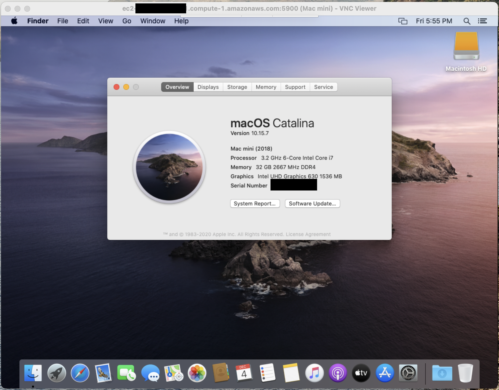

## Contents
- Container Support for Lambda
- Introducing AWS Proton
- EC2 macOS Instances
- First-Class .NET 5 Support for Lambda

## Container Support for Lambda
AWS Lambda supports Docker images up to 10GB in size. They've also provided base images for Lambda runtimes in the new [public ECR](https://gallery.ecr.aws/). For reference, the [base Node.js 12 image](https://gallery.ecr.aws/lambda/nodejs) is ~450MB. The Serverless Application Model (SAM) CLI has already been updated for container support. Instead of specifying a `--runtime`, engineers can now use the `--base-image` flag.

```shell
sam --version 
# 1.13.2
sam init --base-image amazon/nodejs12.x-base
```

This creates a `Dockerfile` for the function.

```dockerfile
FROM public.ecr.aws/lambda/nodejs:12
COPY app.js package.json ./
RUN npm install
CMD ["app.lambdaHandler"]
```

The `deploy` command also includes container registry support via ECR. With a quick `--guided` deployment, I produced the following `samconfig`:
```toml
version = 0.1
[default]
[default.deploy]
[default.deploy.parameters]
stack_name = "sam-app-container-support"
s3_bucket = "aws-sam-cli-managed-default-samclisourcebucket-ENTROPY"
s3_prefix = "sam-app-container-support"
region = "us-east-1"
confirm_changeset = true
capabilities = "CAPABILITY_IAM"
image_repository = "ACCOUNT_NUMBER.dkr.ecr.us-east-1.amazonaws.com/IMAGE_REPOSITORY"
```

All of this made it seamless to deploy a container-based Lambda function with the same ease as `zip`-based ones. I haven't had the opportunity to do performance testing yet, but per [/u/julianwood](https://www.reddit.com/r/aws/comments/k4p5dc/new_for_aws_lambda_container_image_support/geb5o18?utm_source=share&utm_medium=web2x&context=3) from the Lambda team, it should be equivalent.

> Performance is on par with `zip` functions. We don't use Fargate. This is pure Lambda. We optimize the image when the function is created and cache the layers, so the startup time is pretty much the same as `zip` functions. 

A fully-functional example can be found in this [GitHub repository](https://github.com/scottenriquez/aws-reinvent-2020-samples/tree/main/sam-app-container-support).

## Introducing AWS Proton
> AWS Proton is the first fully managed application deployment service for container and serverless applications. Platform engineering teams can use Proton to connect and coordinate all the different tools needed for infrastructure provisioning, code deployments, monitoring, and updates.

During the announcement video, I wasn’t sure what the relationship between Proton and existing DevOps tools like CloudFormation and CodePipeline would be or even who the target audience is. To answer these questions, it makes sense to describe the problem that AWS is aiming to solve.

Per the [Containers from the Couch stream](https://www.youtube.com/watch?v=DZJ8F6lKFuA), AWS understands that not all teams are able to staff with the requisite expertise on a single team (i.e., one team with software engineers, DevOps engineers, security, etc.). To mitigate this, companies often create leveraged teams to provide a specific set of services to other groups (i.e., a centralized platform team that serves multiple development teams). Leveraged teams have their own set of problems, including becoming resource bottlenecks, lack of adequate knowledge sharing mechanisms, and the inability to define and enforce standards.

Proton aims to bridge this gap by offering tooling to standardize environments and services in templates across an organization. It also supports versioning so that environments and services are appropriately maintained. The expectation is that centralized platform teams can support these templates instead of individual solutions with heavily nuanced CloudFormation templates and DevOps pipelines. In Proton, environments are defined as sets of shared resources that individual services are deployed into. At this time, it’s not possible to deploy services without environments. The configurations for environments and services are intended to be utilized throughout the organization (although cross-account sharing isn’t available yet). Changes to templates are published as major and minor versions that are applied to individual instances. Unfortunately, auto-updates are not yet available. Schemas are used within these templates to define inputs for consumers.

I haven’t been able to find much documentation on how to create templates other than [this GitHub repository](https://github.com/aws-samples/aws-proton-sample-templates/tree/main/lambda-crud-svc). The Lambda example there gives insight into the general structure from the `/environment` and `/service` directories. Both types are comprised of schemas, manifests, infrastructure, and pipelines.

As mentioned above, schemas are used to capture inputs. In the sample from GitHub, the only shared environment resource is a DynamoDB table, and the time to live specification is parameterized.

### `/schema.yaml`
```yaml
schema:
  format:
    openapi: "3.0.0"
  environment_input_type: "EnvironmentInput"
  types:
    EnvironmentInput:
      type: object
      description: "Input properties for my environment"
      properties:
        ttl_attribute:
          type: string
          description: "Which attribute to use as the ttl attribute"
          default: ttl
          minLength: 1
          maxLength: 100

```

Defining `/infrastructure` or `/pipeline` sections of the Proton template requires a manifest to describe how exactly to interpret the infrastructure as code. I can't find any documentation for the accepted values, but the template indicates that templating engines like [Jinja](https://jinja.palletsprojects.com/en/2.11.x/) are supported and other infrastructure as code options like CDK may be planned for the future. 

### `/manifest.yaml`
```yaml
infrastructure:
  templates:
    - file: "cloudformation.yaml"
      engine: jinja
      template_language: cloudformation
```

Lastly, a CloudFormation template is used to describe the infrastructure and DevOps automation like CodePipeline. Note the use of Jinja templating (specifically `environment.ttl_attribute`) to reference shared resources and input parameters. 

### `/cloudformation.yaml`
```yaml
AWSTemplateFormatVersion: '2010-09-09'
Transform: AWS::Serverless-2016-10-31
Description: This environment holds a simple DDB table shared between services.
Resources:
  AppTable:
    Type: AWS::DynamoDB::Table
    Properties:
      AttributeDefinitions:
        - AttributeName: hk
          AttributeType: S
        - AttributeName: rk
          AttributeType: S
      BillingMode: PAY_PER_REQUEST
      KeySchema:
        - AttributeName: hk
          KeyType: HASH
        - AttributeName: rk
          KeyType: RANGE
      GlobalSecondaryIndexes:
        - IndexName: reverse
          KeySchema:
            - AttributeName: rk
              KeyType: HASH
            - AttributeName: hk
              KeyType: RANGE
          Projection:
            ProjectionType: ALL 
      TimeToLiveSpecification:
        AttributeName: "{{ environment.ttl_attribute }}"
        Enabled: true

```

When the template is finished, compress the source code, push to S3, create a template, and publish it.
```shell
# create an environment template
aws proton-preview create-environment-template \
  --region us-east-1 \
  --template-name "crud-api" \
  --display-name "CRUD Environment" \
  --description "Environment with DDB Table"
# create a major version of the template (1)
aws proton-preview create-environment-template-major-version \
  --region us-east-1 \
  --template-name "crud-api" \
  --description "Version 1"
# compress local source code
tar -zcvf env-template.tar.gz environment/
# copy to S3
aws s3 cp env-template.tar.gz s3://proton-cli-templates-${account_id}/env-template.tar.gz --region us-east-1
# delete local artifact
rm env-template.tar.gz
# create a minor version (0)
aws proton-preview create-environment-template-minor-version \
  --region us-east-1 \
  --template-name "crud-api" \
  --description "Version 1" \
  --major-version-id "1" \
  --source-s3-bucket proton-cli-templates-${account_id} \
  --source-s3-key env-template.tar.gz
# publish for users
aws proton-preview update-environment-template-minor-version \
  --region us-east-1 \
  --template-name "crud-api" \
  --major-version-id "1" \
  --minor-version-id "0" \
  --status "PUBLISHED"
# instantiate an environment
aws proton-preview create-environment \
  --region us-east-1 \
  --environment-name "crud-api-beta" \
  --environment-template-arn arn:aws:proton:us-east-1:${account_id}:environment-template/crud-api \
  --template-major-version-id 1 \
  --proton-service-role-arn arn:aws:iam::${account_id}:role/ProtonServiceRole \
  --spec file://specs/env-spec.yaml
```

The process for publishing and instantiating services is largely the same.

## EC2 macOS Instances
The prospect of having macOS support for EC2 instances is exciting, but the current implementation has some severe limitations. First off, the instances are only available via [dedicated hosts](https://aws.amazon.com/ec2/dedicated-hosts/) with a minimum of a 24-hour tenancy. At an hourly rate of USD 1.083, it’s hard to imagine this being economically viable outside of particular use cases. The only AMIs available are 10.14 (Mojave) and 10.15 (Catalina), although 11.0 (Big Sur) is coming soon. There’s also no mention of support for AWS Workspaces yet, which I hope is a future addition given the popularity of macOS amongst engineers. Lastly, the new Apple M1 ARM-based chip isn’t available until next year.

Despite the cost, I still wanted to get my hands on an instance. I hit two roadblocks while getting started. First, I had to increase my service quota for `mac1` dedicated hosts. Second, I had to try several availability zones to find one with dedicated hosts available (`use1-az6`). I used the following CLI commands to provision a host and instance. 

```shell
# create host and echo ID
aws ec2 allocate-hosts --instance-type mac1.metal \
  --availability-zone us-east-1a --auto-placement on \
  --quantity 1 --region us-east-1
# create an EC2 instance on the host
aws ec2 run-instances --region us-east-1 \
  --instance-type mac1.metal \
  --image-id ami-0e813c305f63cecbd \
  --key-name $KEY_PAIR --associate-public-ip-address \
  --placement 'HostId=$HOST_ID' \
  --block-device-mappings 'DeviceName=/dev/sda1,Ebs={DeleteOnTermination=true,VolumeSize=250,VolumeType=gp2}'
```

After that, I was able to SSH in and experience EC2 macOS in all its glory.

```
             .:'
         __ :'__       __|  __|_  )
      .'`  `-'  ``.    _|  (     /
     :          .-'   ___|\___|___|
     :         :
      :         `-;   Amazon EC2
       `.__.-.__.'    macOS Catalina 10.15.7
```

Thanks to [this awesome blog post](https://simple-minds-think-alike.hatenablog.com/entry/ec2-mac-instance), I was able to put together an EC2 user data script for remote access.

```shell
sudo su
dscl . -create /Users/Scottie
dscl . -create /Users/Scottie UserShell /bin/zsh
dscl . -create /Users/Scottie RealName "Scottie Enriquez"
dscl . -create /Users/Scottie UniqueID 1000
dscl . -create /Users/Scottie PrimaryGroupID 1000
dscl . -create /Users/Scottie NFSHomeDirectory /Users/Scottie
dscl . -passwd /Users/Scottie $USER_PASSWORD
dscl . -append /Groups/admin GroupMembership Scottie
/System/Library/CoreServices/RemoteManagement/ARDAgent.app/Contents/Resources/kickstart \
-activate -configure -access -on \
-clientopts -setvnclegacy -vnclegacy yes \
-clientopts -setvncpw -vncpw $VNC_PASSWORD \
-restart -agent -privs -all
```

I then used [VNC Viewer](https://www.realvnc.com/en/connect/download/viewer/) to connect over port `5900`.



## First-Class .NET 5 Support for Lambda
According to [AWS](https://aws.amazon.com/blogs/developer/net-5-aws-lambda-support-with-container-images/):
> .NET 5, which was released last month, is a major release towards the vision of a single .NET experience for .NET Core, .NET Framework, and Xamarin developers. .NET 5 is a “Current” release and is not a long term supported (LTS) version of .NET. The next LTS version will be .NET 6, which is currently scheduled to be released in November 2021. .NET 5 will be supported for 3 months after that date, which means that .NET 5 will be supported for about 15 months in total. In comparison, .NET 6 will have 3 years of support. Even though Lambda’s policy has always been to support LTS versions of language runtimes for managed runtimes, the new container image support makes .NET 5 a first-class platform for Lambda functions.

While AWS has already released the [.NET 5 public ECR image](https://gallery.ecr.aws/lambda/dotnet), SAM support as a `--base-image` hasn't been implemented yet as of version `1.13.2`. Porting from a .NET Core starter template is as easy as changing the `<TargetFramework>` in the `.csproj` file and updating the `Dockerfile`.

```Dockerfile
FROM mcr.microsoft.com/dotnet/sdk:5.0 as build-image

ARG FUNCTION_DIR="/build"
ARG SAM_BUILD_MODE="run"
ENV PATH="/root/.dotnet/tools:${PATH}"

RUN apt-get update && apt-get -y install zip

RUN mkdir $FUNCTION_DIR
WORKDIR $FUNCTION_DIR
COPY Function.cs HelloWorld.csproj aws-lambda-tools-defaults.json $FUNCTION_DIR/
RUN dotnet tool install -g Amazon.Lambda.Tools

RUN mkdir -p build_artifacts
RUN if [ "$SAM_BUILD_MODE" = "debug" ]; then dotnet lambda package --configuration Debug; else dotnet lambda package --configuration Release; fi
RUN if [ "$SAM_BUILD_MODE" = "debug" ]; then cp -r /build/bin/Debug/net5.0/publish/* /build/build_artifacts; else cp -r /build/bin/Release/net5.0/publish/* /build/build_artifacts; fi

FROM public.ecr.aws/lambda/dotnet:5.0

COPY --from=build-image /build/build_artifacts/ /var/task/
CMD ["HelloWorld::HelloWorld.Function::FunctionHandler"]
```

A working example can be found [here](https://github.com/scottenriquez/aws-reinvent-2020-samples/tree/main/dotnet5-lambda).