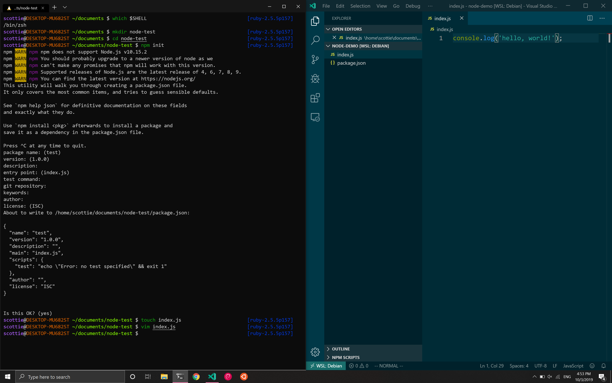

# Contents
Visual Studio Live in San Diego was an amazing opportunity to learn about new Microsoft technology like Azure's artificial intelligence offerings and .NET Core 3.0. I attended some talks about leadership and Agile as well. I've put together several proofs of concept and documented what I learned about:
- Azure Cognitive Services
- ASP.NET Core Health Checks and Startup.cs Inline Endpoints
- .NET Core CLI Tooling for AWS Lambda
- .NET Core 3.0 Linux Worker with systemd Integration
- Windows Subsystem for Linux 2 and Windows Terminal
- The Dynamics of a Healthy Team
- Goodhart's Law and the Hawthorne Effect

# Azure Cognitive Services
The keynote this year was *AI for the Rest of Us* and was delivered by Damian Brady. One of the core themes of the talk is that artificial intelligence and machine learning has become infinitely more accessible to programmers. Cloud providers have made their algorithms and statistical models available via easily consumable RESTful services. Much of the talk centered around a sample web application that consumed Azure's out-of-the-box computer vision and translation services to manage a company's inventory. One feature was identifying an item in a picture returned to a warehouse. Another was translating foreign customer reviews to English and analyzing their sentiment.

I decided to put together a couple of quick demos and was truly amazed with the results. In about 20 lines of Python 3 code and 10 minutes, I was able to read text from an [image on a whiteboard](https://scottie-io.s3.amazonaws.com/vslive-whiteboard.jpg). You can find a `pipenv`-enabled demo [here](https://github.com/scottenriquez/visual-studio-live-2019-azure-computer-vision).

```python
subscription_key = os.environ['COMPUTER_VISION_SUBSCRIPTION_KEY']
endpoint = os.environ['COMPUTER_VISION_ENDPOINT']
computervision_client = ComputerVisionClient(endpoint, CognitiveServicesCredentials(subscription_key))
remote_image_printed_text_url = 'https://scottie-io.s3.amazonaws.com/vslive-whiteboard.jpg'
recognize_printed_results = computervision_client.batch_read_file(remote_image_printed_text_url, raw=True)
operation_location_remote = recognize_printed_results.headers["Operation-Location"]
operation_id = operation_location_remote.split("/")[-1]
while True:
	get_printed_text_results = computervision_client.get_read_operation_result(operation_id)
	if get_printed_text_results.status not in ['NotStarted', 'Running']:
		break
	time.sleep(1)
if get_printed_text_results.status == TextOperationStatusCodes.succeeded:
	for text_result in get_printed_text_results.recognition_results:
		for line in text_result.lines:
			print(line.text)
			print(line.bounding_box)
```

In about 10 lines of C# using .NET Core 3.0, I was able to detect the language and sentiment of generic text. You can find the full code [here](https://github.com/scottenriquez/visual-studio-live-2019-azure-text-analysis).

```csharp
string textToAnalyze = "今年最強クラスの台風が週末3連休を直撃か...影響とその対策は？";
ApiKeyServiceClientCredentials credentials = new ApiKeyServiceClientCredentials(subscriptionKey);
TextAnalyticsClient client = new TextAnalyticsClient(credentials)
{
	Endpoint = endpoint
};
OutputEncoding = System.Text.Encoding.UTF8;
LanguageResult languageResult = client.DetectLanguage(textToAnalyze);
Console.WriteLine($"Language: {languageResult.DetectedLanguages[0].Name}");
SentimentResult sentimentResult = client.Sentiment(textToAnalyze, languageResult.DetectedLanguages[0].Iso6391Name);
Console.WriteLine($"Sentiment Score: {sentimentResult.Score:0.00}");
```

These are features that I would have previously told clients were completely out of the question given the complex mathematics and large data set required to train the models. Developers can now reap the benefits of machine learning with virtually no knowledge of statistics.

# ASP.NET Core Health Checks and Inline Endpoints
.NET Core now supports built-in service health checks that can be easily configured in `Startup.cs` with a couple of lines of code.

```csharp
public class Startup
{
	public void ConfigureServices(IServiceCollection services)
	{
		services.AddHealthChecks();
	}

	public void Configure(IApplicationBuilder app)
	{
		app.UseRouting();
		app.UseEndpoints(endpoints =>
		{
			endpoints.MapHealthChecks("/health");
		});
	}
}
```

This creates a `/health` endpoint that returns an HTTP status code and brief message indicating whether or not the API is available and can process requests. This is ideal for integrating with load balancers, container orchestrators, and reports. If the default checks don't suffice for your needs, you can also create custom health check by implementing the `IHealthCheck` interface and registering it. Be aware that health checks are intended to be able to run quickly, so if the custom health check has to open connections with other systems or perform lengthy I/O, the polling cycle needs to account for that.

```csharp
public class MyHealthCheck : IHealthCheck
{
	public Task CheckHealthAsync(
		HealthCheckContext context,
		CancellationToken cancellationToken = default(CancellationToken))
	{
		return Task.FromResult(HealthCheckResult.Healthy("A healthy result."));
	}
}
```

You can also create simple HTTP endpoints inline in `Startup.cs` without creating an API controller class in addition to registering API controllers normally.

```csharp
app.UseEndpoints(endpoints =>
{
	endpoints.MapControllers();
	endpoints.Map("/startup", context =>
	{
		return context.Response.WriteAsync("This is from Startup.cs");
	});
	endpoints.MapHealthChecks("/health");
});
```

Find the complete source code [here](https://github.com/scottenriquez/visual-studio-live-2019-endpoint-routing-and-healthchecks).

# .NET Core CLI Tooling for AWS Lambda
AWS has built extensive CLI tooling and templating for building .NET Core serverless functions on Lambda. Assuming you have .NET Core installed and added to your `PATH`, you can run `dotnet new -i Amazon.Lambda.Templates` to install the Lambda templates and `dotnet tool install -g Amazon.Lambda.Tools` to install the Lambda tools. With a few commands, you can have a brand new .NET Core serverless function created, deployed to AWS, and invoke the function from the command line.

```shell script
#!/usr/env/bin bash
# create a new serverless function from the Lambda template
dotnet new lambda.EmptyFunction --name MyFunction
# validate that the skeleton builds and initial unit tests pass
dotnet test MyFunction/test/MyFunction.Tests/MyFunction.Tests.csproj
# navigate to the project directory
cd MyFunction/src/MyFunction
# deploy function to AWS
dotnet lambda deploy-function MyFunction --function-role role
# validate that the Lambda function was properly created
dotnet lambda invoke-function MyFunction --payload "Hello, world!"
```

# .NET Core 3.0 Linux Worker with systemd Integration
When I first wrote my first line of C# code back in 2012 as a young intern, .NET Core didn’t exist yet. At the time, .NET hadn't been open-sourced yet either. While powerful, .NET Framework was monolithic and only ran on Windows natively. Throughout college, I used Ubuntu and macOS and hadn't touched a Windows machine in years except for gaming. As a student, I fell in love with shells and preferred CLIs over cumbersome IDEs. While I remained a Unix enthusiast at home (macOS, Debian, and Manjaro), I felt that there was such a clear divide between this enterprise tool and the up-and-coming juggernaut in Node.js that was beginning to eat the server-side market share in an explosion of microscopic NPM packages.

Though I grew to love the crisp C# syntax and bundles of functionality in .NET Framework, .NET Core made me fall in love again. The first time that I wrote `dotnet build` and `dotnet run` on macOS was such a strange feeling. Even though Mono brought the CLR to Linux many years ago, being able to compile and run C# code on the .NET runtime out of the box was so satisfying. Sometimes, it still blows me away that I have a fully fledged .NET IDE in JetBrains' Rider running on my Debian box. All this to say, Microsoft's commitment to Linux makes me excited for the future.

At Visual Studio Live this year, one of the new features discussed is systemd integration on Linux, which is analogous to writing Windows Services. The thought of writing a systemd service using .NET Core 3.0 (which was just released a few days ago) was pretty exciting, so I put together [a fully functional example project to capture and log internet download speeds every minute](https://github.com/scottenriquez/visual-studio-live-2019-isp-speed-systemd).

I started by using the worker service template included in both Visual Studio and Rider. Configuring for systemd only requires one chained call: `.UseSystemd()`. It's worth noting that this still allows you to build and run using the CLI (i.e. `dotnet run`) without being integrated with systemd.

```csharp
public static IHostBuilder CreateHostBuilder(string[] args) =>
	Host.CreateDefaultBuilder(args)
		.UseSystemd()
		.ConfigureServices((hostContext, services) => { services.AddHostedService(); });
```

The `Worker` executes the given task until a cancellation token is received. I made a few modifications to the starter template such as changing the `Task.Delay()` millisecond parameter and implementing the speed test logic. Note that `_logger` is the dependency injected logging service.

```csharp
protected override async Task ExecuteAsync(CancellationToken stoppingToken)
{
	while (!stoppingToken.IsCancellationRequested)
	{
		SpeedTestClient speedTestClient = new SpeedTestClient();
		Settings settings = speedTestClient.GetSettings();
		Server bestServer = settings.Servers[0];
		_logger.LogInformation("Server name: " + bestServer.Name);
		double downloadSpeed = speedTestClient.TestDownloadSpeed(bestServer);
		_logger.LogInformation("Download speed (kbps): " + downloadSpeed);
		await Task.Delay(60000, stoppingToken);
	}
}
```

I also implemented a simple deployment script to migrate the `.service` file to the correct folder for systemd, map the executable, and start the service. The rest is handled by .NET Core.

```shell script
#!/usr/env/bin bash
dotnet build
dotnet publish -c Release -r linux-x64 --self-contained true
sudo cp speedtest.service /etc/systemd/system/speedtest.service
sudo systemctl daemon-reload
sudo systemctl start speedtest.service
```

# Windows Subsystem for Linux 2 and Windows Terminal
Though many of the talks at Visual Studio Live utilized Linux environments in Azure and AWS, none of the presenters developed in Linux during their demos. Instead they used WSL2 with Windows Terminal. In the latest Insiders build of Windows 10 (build 18917 or higher), Microsoft has shipped a Linux kernel too. This kernel has been specifically tuned for WSL2 and the performance is extremely solid. You can now also install various distros (i.e. Debian, Ubuntu) from the Microsoft Store and interact with them via a CLI.

You can also combine this with a preview of the new Windows Terminal. Which allows you to have multiple tabs running command lines for various environments simultaneously (i.e. PowerShell, Linux, etc.). You can even modify files on your Linux file system with Visual Studio code via a nifty plugin.



I installed Debian 10 plus my usual Linux tools like Vim and Zsh and found that the performance and usability were solid. I even went as far as to install and use some tools that aren't easy to use on Windows like Docker. I was able to run containers without any performance issues. Though all of these features and tools are still in preview, it shows Microsoft's commitment to Linux going forward. It also makes software development on Windows a lot more appealing in my opinion given that the majority of cloud infrastructure runs Linux.

# The Dynamics of a Healthy Team
Though there were numerous exciting technical sessions throughout the week, some of my most valuable takeaways from the conference came from Angela Dugan's talks about leadership and metrics. Many of her points echoed much of the reading that I've done since transitioning to leadership about a year ago.

The first takeaway is that as leaders we need to find ways to create more continuous collaboration. According to quantitative surveys and informal discussion, one common complaint is that my team's developers often work alone on projects. While they often collaborate with business analysts and solution integrators outside of our team, it's quite common for us to only have the bandwidth to assign one software developer given their supply and demand. A recurring theme from the conference talks and Certified Scrum Master training is that cohesion and chemistry comes from the same team working on different projects.

One way to help achieve this goal is to decrease the number of simultaneous projects (i.e. works-in-progress) assigned to a developer. Admittedly, this is an area that I've fallen short in as a leader. In terms of resource planning, trying to make ends meet feels like a game of Tetris. It's difficult to prevent and manage an extensive buildup of backlog items, but managing client relations and expectations is even harder. For the sake of business satisfaction, we'll often compromise by dividing a developer's time between multiple efforts so that the clients feel that they're getting a timely response time. However, the taxes of context switching negate the benefits of being able to focus on one project at a time. Fundamentally, this is analogous to the divide and conquer principle in computer science. Even the smartest humans are bad at multitasking.

The final takeaway I had was that it's not enough to merely identify cultural and personality differences. My team has taken multiple personality tests to understand how we all view the world differently. As a company, we've hosted numerous multicultural events to understand how culture impacts our work (see Outliers by Malcolm Gladwell). However, I feel that my team doesn't necessarily work any differently despite these efforts yet.

# Goodhart's Law and the Hawthorne Effect
During a fantastic talk on the dangers and benefits of collecting metrics, Angela introduced these two concepts that eloquently summed up some of the challenges my team has with identifying and reporting on quality metrics: Goodhart's Law and the Hawthorne Effect.

Goodhart's Law states that "when a measure becomes a target, it ceases to be a good measure." During the presentation, my mind immediately wandered to the arbitrary metric of time. Like many other giant corporations, my company has countless avenues of tracking time. I had a simple hypothesis that I was able to quickly validate by pulling up my timesheets: my hours always add up to 40 hours per week. If I have a doctor's appointment in the morning, I don't always stay late to offset it. On days that I have an 8pm CST call with Australia, I don't always get to leave the office early to get that time back. My boss certainly doesn't care, and I certainly wouldn't sweat a developer on my team for not working exactly 40 hours per week.

So why has time become the key target? Hypothetically, if I only worked 20 hours in a given week, nothing is stopping me from marking 40 hours. No one in their right mind is going to enter less than that. I'd also argue that some people wouldn't feel empowered to enter more than that. In reality, numerous other metrics would reflect my poor performance. All this makes me realize that any metric that's self-reported with arbitrary targets and a negative perception of its intentions is going to lead to false information and highly defensive data entry.

The next logical progression is considering a burndown chart. The x-axis represents time, and the y-axis often represents remaining effort in a two-week sprint. In a utopian world, the line of best fit would be a linear function with a negative slope. The reality is that project or portfolio managers call me when the burndown rate isn't fast enough for their liking. But again, why is the focus here time? Why aren't the most important metrics features delivered and customer satisfaction? Why not a burnup chart?

The Hawthorne Effect refers to the performance improvement that occurs when increased attention is paid to an employee's work. For a simple thought experiment, imagine that your job is to manually copy data from one system to another. Naturally, your throughput would be substantially improved if you got frequent feedback on how much data you were copying. It would probably also increase if your boss sat right behind you all day.

In leadership, we constantly observe our employees' work though I would argue it's rarely in the most productive contexts. Instead of measuring developers purely based on how many features they deliver, we almost always relate them to the estimates they're forced to give based on minimal and sometimes incorrect requirements as well as arbitrary and often unrealistic dates set by both ourselves and our customers. I can think of several metrics I track to report on project and operation health, but none that reflect a developer's happiness or psychological safety.

As a leader, I've fallen short in shielding developers from this. Consider the difference between "can you have this feature done by the end of the year?" and "how long will it take to deliver this feature?" The answer should ultimately be static between the two scenarios, but in the former question, I'm shifting the responsibility to deliver onto the developer. The developer feels immense pressure to conform their estimate to the context they've been placed in. As a leader, the responsibility should fall solely on me though. If the developer can't deliver the feature by the end of the year, it's up to me to acquire another resource or set more realistic expectations with the client.