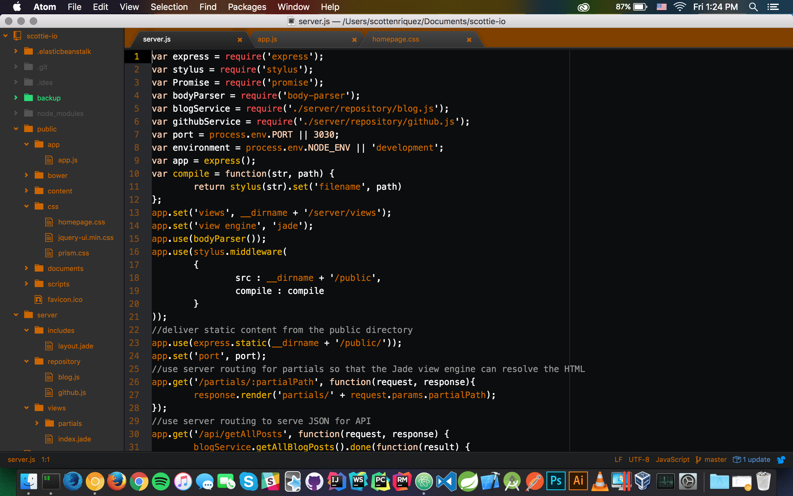

It's safe to say that I'm biased because of my alma mater, but I personally think that burnt orange is one of the most versatile colors. It's somewhat polarizing due to being the primary color of the University of Texas, but I use it as one of the core colors here on my personal website to show my Longhorn pride. Inspired by this color palette, I've created a theme for Atom, my favorite text editor, and released version 1.0.0 just in time for the start of college football season.

To use this theme, ensure that you have the Atom text editor installed. Themes in Atom are split into UI themes and syntax themes. Syntax themes change the style for the text editing area itself, and UI themes change the style everything else. I have created both, and they can be installed either through the application menus or via the command line using `apm install atom-burnt-orange-ui` and `apm install atom-burnt-orange-syntax`. For more information and the source code, check out the Atom documentation pages for [atom-burnt-orange-ui](https://atom.io/packages/atom-burnt-orange-ui) and [atom-burnt-orange-syntax](https://atom.io/packages/atom-burnt-orange-syntax).

I'm by no means a UI/UX expert, so feel free to submit a pull request for any improvements. I intend on maintaining the code for future Atom releases.
