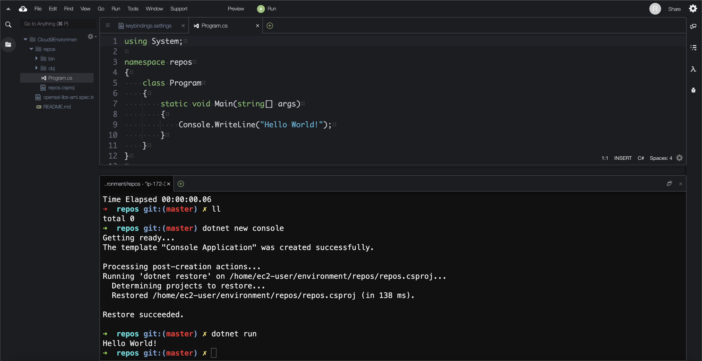

## Cloud9 Overview and Use Cases
[Per AWS](https://aws.amazon.com/cloud9/), "Cloud9 is a cloud-based integrated development environment (IDE) that lets you write, run, and debug your code with just a browser. It includes a code editor, debugger, and terminal. Cloud9 comes prepackaged with essential tools like Docker and support for popular programming languages, including JavaScript, Python, PHP, and .NET." The AWS, Serverless Application Model (SAM), and Cloud Development Kit (CDK) CLIs are pre-installed as well. Users are abstracted from credential management (i.e., there's no need to provision an IAM user and run `aws configure`). Since the underlying compute is an EC2 instance, developers have a consistent experience across client devices.



Cloud9 makes it easy to declare an environment using CloudFormation, specify Git repositories to clone during the provisioning process, and share various custom settings such as themes and keybindings with developers. It's also a cheap option since the EC2 instance shuts itself down after a set period of time (with a default of 30 minutes).

## Initial Setup
The first deployment fails unless a Cloud9 environment has been created from the Console due to an IAM service role created in the process (`!Sub arn:aws:iam::${AWS::AccountId}:role/service-role/AWSCloud9SSMAccessRole`). See more information [in the AWS documentation](https://docs.aws.amazon.com/cloud9/latest/user-guide/ec2-ssm.html#access-ec2-session).

## AWS Resources Created
- A Cloud9 environment with an `m5.large` instance EC2 instance
- A CodeCommit repository for stashing work since the Cloud9 environment is considered transient

## CloudFormation Template
```yaml
Resources:
  rCloud9Environment:
    Type: AWS::Cloud9::EnvironmentEC2
    Properties:
      AutomaticStopTimeMinutes: 30
      ConnectionType: CONNECT_SSM
      Description: Web-based cloud development environment
      InstanceType: m5.large	
      Name: Cloud9Environment
      Repositories: 
        - PathComponent: /repos/codecommit
          RepositoryUrl: !GetAtt rCloud9WorkingRepository.CloneUrlHttp
        - PathComponent: /repos/aws-cloud9-environment
          RepositoryUrl: https://github.com/scottenriquez/aws-cloud9-environment.git
  rCloud9WorkingRepository:
    Type: AWS::CodeCommit::Repository
    Properties:
      RepositoryName: Cloud9WorkingRepository
      RepositoryDescription: A CodeCommit repository for stashing work from the Cloud9 IDE
```
This template can be deployed via the AWS Console or the AWS CLI.

## Initialization Script
```shell
wget https://github.com/dotnet/core/files/2186067/openssl-libs-ami.spec.txt
rpmbuild --bb openssl-libs-ami.spec.txt
sudo rpm -i /usr/src/rpm/RPMS/x86_64/openssl-libs-1.0.0-0.x86_64.rpm
sudo rpm -Uvh https://packages.microsoft.com/config/centos/7/packages-microsoft-prod.rpm
sudo yum install dotnet-sdk-3.1 zsh
sudo passwd ec2-user
chsh -s /bin/zsh
sh -c "$(curl -fsSL https://raw.github.com/ohmyzsh/ohmyzsh/master/tools/install.sh)"
```
The `user-data.sh` script is intended to run when the Cloud9 instance spins up (mirroring the EC2 instance paramater of the same name). Unfortunately, this setup must be done manually since there isn't a parameter in the CloudFormation resource. To make this easier, I've added [this GitHub repository](https://github.com/scottenriquez/aws-cloud9-environment) to the list to clone on the instance.

The Bash script does the following:
- Installs .NET Core 3.1
- Installs Zsh and Oh My Zsh
- Resets the `ec2-user` password
- Changes the default shell to Zsh

## User Settings
```json
{
    "ace": {
        "@behavioursEnabled": true,
        "@fontSize": 18,
        "@keyboardmode": "vim",
        "@showGutter": true,
        "@showInvisibles": true,
        "@theme": "@c9/ide/plugins/c9.ide.theme.jett/ace.themes/jett",
        "custom-types": {
            "json()": {
                "settings": "javascript"
            }
        },
        "statusbar": {
            "@show": true
        }
    },
    "build": {
        "@autobuild": false
    },
    "collab": {
        "@timeslider-visible": false
    },
    "configurations": {},
    "debug": {
        "@autoshow": true,
        "@pause": 0
    },
    "general": {
        "@autosave": "afterDelay",
        "@skin": "jett-dark"
    },
    "key-bindings": {
        "@platform": "auto",
        "json()": []
    },
    "openfiles": {
        "@show": false
    },
    "output": {},
    "projecttree": {
        "@showhidden": false
    },
    "tabs": {
        "@show": true
    },
    "terminal": {
        "@fontsize": 18
    }
}
```
Much like the `user-data`, the user settings aren't parameterized in CloudFormation. These settings are included in the repository but must be manually configured.