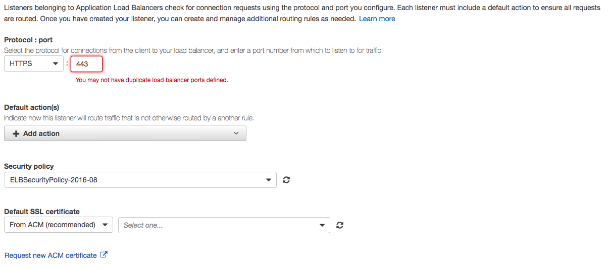
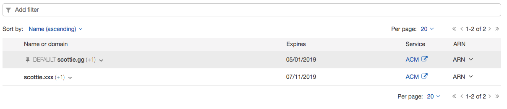

# The Use Case

I own two domains for my personal site. I have a primary domain that I use for most occasions, but I also recently acquired another. Rather than having the second domain remain unused, my goal was simply to have both configured simultaneously without configuring multiple environments.

# The Architecture

My website has used HTTPS for some time, but this initially complicated the plan of using two domains in parallel. I’ve been hosting this website on Amazon Web Services via Elastic Beanstalk for about three years now. The process of managing SSL certificates has been quite easy using a combination of Elastic Load Balancing and AWS Certificate Manager. However, what’s now known as a Classic Load Balancer only supports one certificate per port and protocol (i.e. HTTPS, 443). Given that SSL certificates are tied to one domain, the lone certificate on the load balancer would not be valid for my second domain and a security warning would be thrown in the browser.

# Migrating to an Application Load Balancer

Since my Elastic Beanstalk environment was configured before the new Application Load Balancer was released, I laid it to rest and provisioned a fresh application with one. There may be a way via the settings to convert an existing Classic Load Balancer to Application Load Balancer, but I was unable to find a quick solution. You can find the differences between load balancer offerings in Amazon’s documentation.

# Configuring the Listener

Unless specified otherwise during the provisioning process, no HTTPS listener will be configured. Just like my Classic Load Balancer, I created an HTTPS listener on port 443 and chose my primary domain’s SSL certificate from ACM as the default. Application Load Balancers also only allow one listener per protocol, so one more step must be taken.

# Adding Certificates

Via the EC2 interface you can edit your load balancer’s listeners settings and add more SSL certificates. That’s all you need to configure.

The rest is handled by the magic of Server Name Indication (SNI) which Application Load Balancers use as of October 2017. The load balancer will use the correct SSL certificate based on the domain specified in the request.
