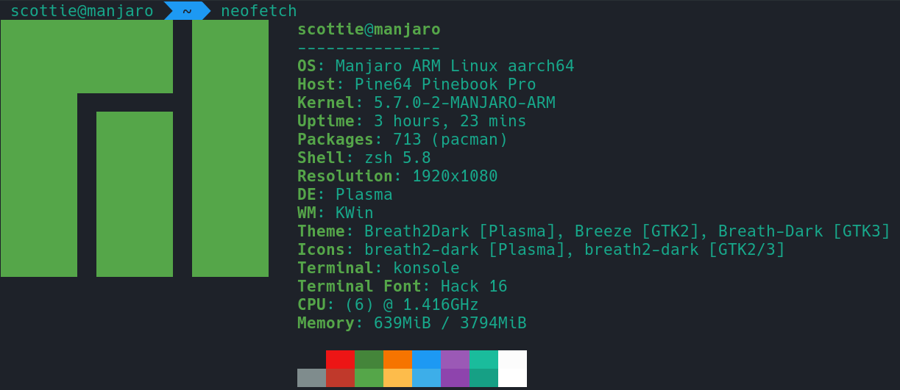

## Hardware

For 200 USD, the laptop is extremely well-made. The keyboard is comfortable for typing (although PINE64 only had the ISO keyboard model available which is an adjustment for me). The body is made out of metal and doesn't feel cheap. The sound is serviceable though one of the weaker parts of the laptop. I consistently get download speeds of up to 50mbps over AT&T fiber at home. The battery life has been good so far. There are no glaring design flaws to speak of. Here's an overview of the specs:

- Rockchip RK3399 SOC with Mali T860 MP4 GPU
- 4GB LPDDR4 RAM
- 1080p IPS Panel
- 64GB of eMMC
- Lithium Polymer Battery (10000mAH)
- WiFi 802.11 AC + Bluetooth 5.0
- Front-Facing Camera (1080p)

The laptop ships by default with Manjaro KDE for the operating system:

## Development Usage

I was initially concerned about the fact that the laptop has an ARM processor, which adds a layer of complexity to software installation. I use Snap for managing many of my development tools and found that ARM support is a wash. Visual Studio Code and the JetBrains IDE suite can't be installed via Snap, but software like Docker and Chromium worked perfectly.

For Node.js, I had no major issues with hacking on a few GatsbyJS projects. I noticed in the `npm install` output that some packages with low-level dependencies had to compile from source. After being accustomed to a 2017 15-inch MacBook Pro, the Gatsby static website generation was noticeably slower. Builds took upwards of 20 seconds for reasonably sized websites compared to roughly two seconds on my MacBook.

I've been using Swift as my primary language lately, but I wasn't able to get it working in any native capacity on the PINEBOOK Pro. The Swift package in the Arch User Repository doesn't support ARM. The dependencies list for compiling from [source](https://github.com/apple/swift) are specific to Ubuntu/APT. I couldn't even get the Swift Docker image to run with a simple `docker pull swift` and `docker run swift`. While I certainly wasn't expecting to get Xcode running, I assumed that I'd be able to compile and run Swift. My only option was a browser-based environment called [Repl.it](https://repl.it/@scottenriquez/swift-hello-world).

## IDEs

I was able to manually install JetBrains' WebStorm, my preferred JavaScript IDE, and PyCharm, my preferred Python IDE. On my macOS devices, I use numerous plugins such as Material Theme that can be resource-intensive. Most of the plugins worked without issue. JetBrains' Markdown plugin was the only one that I couldn't get to work without crashing when I opened a `.md` file. The primary feature that isn't compatible out-of-the-box with ARM is the built-in terminal, although there seems to be a workaround. Personally, alt-tabbing to Konsole doesn't bother me. Editing a medium-sized JavaScript project consumed around 1GB of 4GB of memory, and I did see via htop that the CPU was often at capacity during intensive code editing operations.

I found some [unofficial ARM binaries for Visual Studio Code](https://code.headmelted.com/) to install the editor. I tend to use this more because it's less resource-hungry than the JetBrains products for my permutation of plugins.
