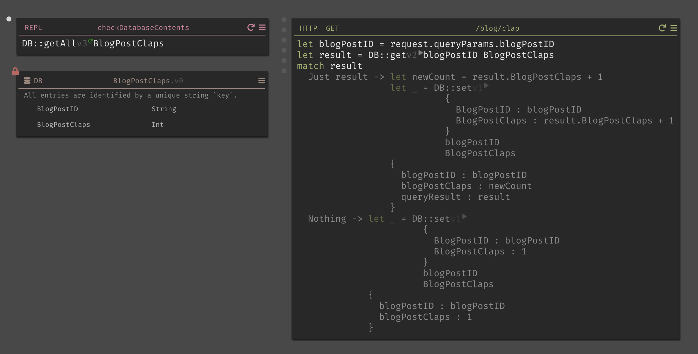

# An Oral History of My Blog

I started writing this blog back in 2012 as an undergrad. Back then, I was a dweeby student with a passion for studying the Japanese language and wanted to share my knowledge with the world. The blog started as a WordPress site that I installed on Bluehost. My first exposure to web development was hacking PHP and CSS to make minor tweaks to the core codebase. In 2014, I rebuilt my blog from scratch armed with budding knowledge of Node.js, AngularJS, and Elastic Beanstalk. For several years, the unnecessary complexities of Jade templating and Stylus CSS preprocessing rendered my webpages from a single Linux EC2 instance chugging away night and day. In 2017, my site's architectural complexity increased yet again when I rewrote the Express API endpoints as serverless function handlers serving up post content from a DynamoDB table. Angular's popularity had largely fallen by the wayside and was replaced with React, which I hosted in an S3 bucket distributed by CloudFront. At this rate, one might have expected that I would have used Kubernetes for the next major version.

# Cue JAMstack

For once, things are much cheaper and performant without copious complexity. JAM stands for JavaScript, APIs, and markup. The core principles are pretty simple: abstract server-side business logic over RESTful APIs and pre-build the markup for webpages. Most of the server-side logic of a blog is fetching and pre-processing the dynamic content from persistent storage. While keeping that content (i.e. posts) co-located with the source code would yield incredible performance, the site would lose the functionality that comes with easily programmable logic like querying said content. Developers can now have the best of both worlds and create blazingly fast websites for an extremely low cost by serving dynamic content as static webpages.

# Using Gatsby

Gatsby is a framework based on React that makes it simple and fast to deploy massively performant web applications very quickly. React developers can build components in the same way as before. Much of the power comes from the addition of GraphQL to query disparate sources of content like CMSs, APIs, and Markdown together. Gatsby's Markdown supports allows developers to now write webpages in the wonderfully simple syntax of Markdown, which many developers know from writing wikis and READMEs. Each post for this blog is now a Markdown file in the source code.

```markdown
# H1 Text

This gets wrapped in a <p> tag.

[This is a hyperlink](https://www.scottie.is/)


```

# MDX

MDX adds a new dimension of features for developers in Markdown pages by seamlessly integrating JSX. Markdown syntax is simple and allows limited content structuring, but the ability to write modern JavaScript inside of it is a gamechanger. Client-side logic, React components, and API calls are now all possible inside of a Markdown file with the performance of a static webpage.

```markdown
import MyReactComponent from '../src/components/myReactComponent'

# H1 Text

This gets wrapped in a <p> tag.

[This is a hyperlink](https://www.scottie.is/)

<MyReactComponent input={'Hello, world!'} />


```

# Putting It Together

Inside of a React component for a blog index page, the MDX files can be queried client-side using GraphQL then rendered using JSX.

```graphql
query {
  site {
    siteMetadata {
      title
    }
  }
  allMdx(sort: { fields: [frontmatter___date], order: DESC }) {
    edges {
      node {
        excerpt
        fields {
          slug
        }
        frontmatter {
          date(formatString: "MMMM DD, YYYY")
          title
          description
        }
      }
    }
  }
}
```

Content that would have been offloaded to an S3 bucket or separate CDN is now co-located with the source code for build optimizations handled by Gatsby. Plugins and themes are individually packaged and can be easily added and configured with the project's `gatsby-config.js`.

# Deploying to Netlify via GitHub

For the past five or so years, AWS has been my exclusive hosting provider. While learning about JAMstack, I read about Netlify which provides an end-to-end platform for distributing highly performant, static websites. As part of the Netlify setup process via the web GUI, you can create a new environment, purchase or verify custom domains, provision an SSL certificate via Let's Encrypt, and create a CI/CD pipeline triggered by commits to a GitHub repository. All of this is free of charge and takes only a few minutes to get started. There's also a Netlify CLI in case you want to integrate with another pipeline or tool.

# Build Status

[](https://app.netlify.com/sites/nifty-booth-3bed9d/deploys)

# Overall Thoughts

It's been interesting so far writing a blog post in WebStorm, my preferred IDE. I also installed a grammar and spelling checking plugin there. Markdown is much more natural to write than HTML for new content. Viewing my posts as I write them via a local webserver with hot reloading is handy compared to having to write to external, persistent storage. Deploying my content with a simple `git push origin master` and letting Netlify take care of the rest is extremely satisfying. You can find all the source code [in this repository](https://github.com/scottenriquez/scottie-is-xxx). As always, I'm sure all of this will be obsolete in a few years.

# Bonus: Dark

I managed to secure a private beta for a backend development platform called Dark recently. Dark is a holistic solution for backends that allows developers to write logic using Darklang, deploy APIs, create databases, and implement background worker processes all from the browser in mere seconds. Resource management and code deployments happen in near real-time, which allows for incredibly fast prototyping and implementation. Even fumbling through some beta issues and limited documentation, I was able to implement a clap feature similar to the one from the website Medium in about an hour. I intend to migrate my serverless functions to Dark shortly.


