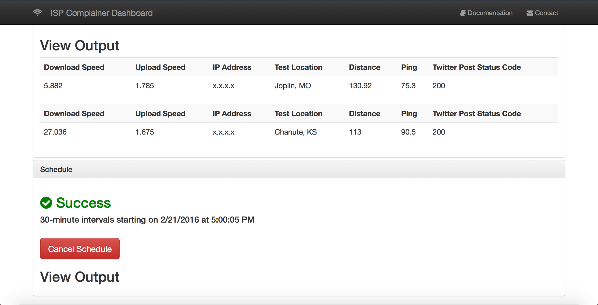

## Motivation

I have long battled my internet service providers, and they have waged war on their customers for many years as well. Poor customer service, data caps with obscene overage charges, and many other issues have plagued me for years like many other Americans. Like many of these people, I’m stuck with only one viable option for a provider due to their monopolistic practices. Recently, I was forced to upgrade to a more expensive monthly plan after going over my data cap three times non-consecutively over a year and a half period. Rather than charging me the usual absurd per-gigabyte overage charge, I’m now stuck paying more per month for the remainder of my time with my ISP.

"You’ll also get an increase in speed as well," the representative told me. Well, I’ve decided to hold my ISP accountable. Since my ISP was so diligent in tracking my overages, I’m going to be diligent in tracking the speeds that I’m getting. [Inspired by a post on Reddit](https://github.com/james-atkinson/speedcomplainer), I built an application to let my ISP know whenever I’m not getting my promised speeds, and I’m running it off of my Raspberry Pi. Here’s how you can use it too.

## Raspberry Pi Setup

Note that you do not need to run ISP Complainer on a Raspberry Pi. I built this application using Node.js, which can run on any operating system. I treat my Raspberry Pi like a little UNIX server and leave it running all the time. If you do not plan on running this on a Pi, you can skip to the next section.

Raspberry Pi uses ARM while most modern desktop processors use the x86 instruction set architecture. Because of this, you’ll need Node.js binaries compiled for ARM. In the early days, these files weren’t maintained like they are for x86 and compiling from the source code was required. This is still a viable option if you want to target a specific version, but you can also just use a download maintained by node-arm using the following commands:

`wget http://node-arm.herokuapp.com/node_latest_armhf.deb`
`sudo dpkg -i node_latest_armhf.deb`

**Update: the ARM binaries are now available on the [Node.js downloads](https://nodejs.org/en/download/) page.**

## Local Setup

Once Node.js and NPM are installed, fetch the code for ISP Complainer using the command `git clone git@github.com:scottenriquez/isp-complainer.git`. You can also access the repository [via the web interface](https://github.com/scottenriquez/isp-complainer). Once the repository had been cloned, navigate to the `/isp-complainer` root folder and install all dependencies using the `npm install` command. Then, start the web server with the command `node server.js` or `nodemon server.js`.

## Configuration

Start by creating a Twitter API key. This will allow you to programmatically create tweets to your ISP. You can either create a new Twitter account like I did with @ISPComplainer or use your existing account. Note that in either case, you should treat your API key just like a username and password combination, because if exposed the person who intercepts it can take actions on your behalf. To create an API key, login to the Twitter application management tool and create a new app. Follow all of the steps and take note of the four keys that you’re provided with.

Once you have your keys, you’ll need to add them to a file called `/server/configs/twitter-api-config.js`. This file is excluded by the `.gitignore` so that the API key is not exposed upon a commit. Copy the template to a new file using the command `cp twitter-api-config-template.js twitter-api-config.js`, and then enter the keys inside of the quotes of the return statement for each corresponding function. If you would prefer to store these inside of a database, you can inject the data access logic here as well. See the config template below:

### `twitter-api-config-template.js`

```javascript
module.exports = {
  twitterConsumerKey: function () {
    return ""
  },
  twitterConsumerSecret: function () {
    return ""
  },
  twitterAccessTokenKey: function () {
    return ""
  },
  twitterAccessTokenSecret: function () {
    return ""
  },
}
```

One other config must be modified before use:

### `complaint-config.js`

```javascript
module.exports = {
  tweetBody: function (promisedSpeed, actualSpeed, ispHandle) {
    return (
      ispHandle +
      " I pay for " +
      promisedSpeed +
      "mbps down, but am getting " +
      actualSpeed +
      "mbps."
    )
  },
  ispHandle: function () {
    return "@cableONE"
  },
  promisedSpeed: function () {
    return 150.0
  },
  threshold: function () {
    return 80.0
  },
}
```

`tweetBody()` generates what will be tweeted to your ISP. Note that the body must be 140 characters or less including the speeds and ISP’s Twitter handle. `ispHandle()` returns the ISP’s Twitter account name. A simple search should yield your ISP’s Twitter information. Be sure to include the `'@'` at the beginning of the handle. `promisedSpeed()` returns the speed that was advertised to you. `threshold()` is the percent of your promised speed that you are holding your ISP to. If the actual speed is less than your promised speed times the threshold, a tweet will be sent.

Optionally if you want to manually change the port number or environment variable, you can do so in the server file:

### `server.js`

```javascript
...
var port = process.env.PORT || 3030;
var environment = process.env.NODE_ENV || 'development';
...
```

## Using the ISP Complainer Dashboard



After starting the server, you can access the dashboard via http://localhost:3030/. This interface allows two options: manual and scheduled checks. The manual option allows you to kick off individual requests at your will, and the schedule allows you to run the process over custom intervals. All of the scheduling is handled with Angular’s `$interval`, and the results are tracked in the browser. Note that if you close the browser, no more checks will be scheduled and you will lose all of the results currently displayed on the browser.

For any issues or enhancements, feel free to log them in the [issue tracker](https://github.com/scottenriquez/isp-complainer/issues).
