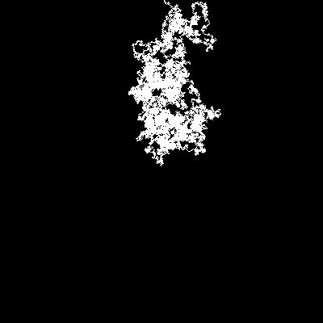
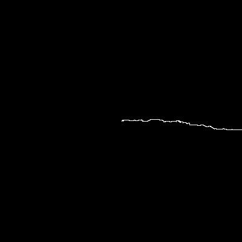

import RandomNormalDistribution from '../../../../src/components/nature-of-code/introduction/randomNormalDistribution'
import BellCurve from '../../../../src/components/nature-of-code/introduction/bellCurve'

## About the Book
Recently, I started reading a fantastic book called The Nature of Code by Daniel Shiffman. From the [Amazon link](https://www.amazon.com/Nature-Code-Simulating-Natural-Processing/dp/0985930802):
> How can we capture the unpredictable evolutionary and emergent properties of nature in software? How can understanding the mathematical principles behind our physical world help us to create digital worlds? This book focuses on a range of programming strategies and techniques behind computer simulations of natural systems, from elementary concepts in mathematics and physics to more advanced algorithms that enable sophisticated visual results. Readers will progress from building a basic physics engine to creating intelligent moving objects and complex systems, setting the foundation for further experiments in generative design.

Daniel implements numerous examples using a programming language called [Processing](https://processing.org). Instead, I decided to write my own versions using GPLs (complete with blog posts and READMEs).

## Running My Code Examples
The source code can be found on [GitHub](https://github.com/scottenriquez/nature-of-code). All examples are built using C# on .NET 6 or JavaScript using React and D3. The folders correspond to chapters and exercises in the book. The prefix consists of a chapter name (e.g., `introduction-`) followed by an exercise number and name (e.g., `01-random-walk`).

For .NET code, navigate to the folder with the `.sln` file and run with:
```shell
dotnet run
```

For React, navigate to the folder with `package.json` and run with:
```shell
npm install
npm start
```

## [Random Walk](https://github.com/scottenriquez/nature-of-code/tree/main/introduction-01-random-walk)
A random walk traces a path through a Cartesian plane going in a random direction with each step (i.e., one pixel). The base image is created in memory as a 400 by 400 black square. The program creates a white pixel at `(200, 200)`. The `Walk` function chooses a random direction, paints another white pixel, and updates the `Walker` object's internal state for current coordinates.
```csharp
private void Walk()
{
    Random random = new Random();
    int step = random.Next(0, 9);
    switch (step)
    {
        case 0:
            CurrentXCoordinate++;
            break;
        case 1:
            CurrentXCoordinate--;
            break;
        case 2:
            CurrentYCoordinate++;
            break;
        case 3:
            CurrentYCoordinate--;
            break;
        // truncated for brevity
        // adds pixels diagonally as well
    }
}
```

The `WalkWeightedRight` function illustrates the same functionality but with a non-uniform distribution. In this code, there's a 70% chance of moving to the right.
```csharp
private void WalkWeightedRight()
{
    Random random = new Random();
    int step = random.Next(0, 10);
    if (step <= 6)
    {
        CurrentXCoordinate++;
    }
    else if (step == 7)
    {
        CurrentXCoordinate--;
    }
    else if (step == 8)
    {
        CurrentYCoordinate++;
    }
    else
    {
        CurrentYCoordinate--;
    }
}
```

The `RandomWalk` function calls the `Walk` or `WalkWeightedRight` function until an edge is hit. The program then saves the image in memory to disk.
```csharp
public void RandomWalk(bool weightedRight)
{
    while (CurrentXCoordinate < Width - 1 && CurrentXCoordinate > 0 && CurrentYCoordinate < Height - 1 &&
            CurrentYCoordinate > 0)
    {
        if (weightedRight)
        {
            WalkWeightedRight();
        }
        else
        {
            Walk();
        }
    }
}
```

| Walk Base                               | Walk Right                            |
| --------------------------------------- | ------------------------------------- |
|                   |  |

## [Random Numbers with Normal Distribution](https://github.com/scottenriquez/nature-of-code/blob/main/introduction-02-probability/probability/src/components/sections/randomNormalDistribution.js)
This example plots random numbers generated with a normal distribution (i.e., no specific weights).

```javascript
const datasetSize = 100;
const maxValue = 100;
const generateRandomData = () => {
	const data = [];
	for(let index = 0; index < datasetSize; index++) {
		data[index] = {
			index: index,
			value: Math.floor(Math.random() * maxValue)
		}
	}
	return data;
}
```

<div>
    <RandomNormalDistribution />
</div>

## [Bell Curve (Frequency Distribution)](https://github.com/scottenriquez/nature-of-code/blob/main/introduction-02-probability/probability/src/components/sections/bellCurve.js)
This example shows how to create a bell curve for one thousand monkeys ranging in height from 200 to 300 pixels with a normal distribution. First, generate the data.

```javascript
const generateHeightData = () => {
	const data = [];
	const datasetSize = 1000;
	const baseHeight = 200;
	const maxRandomValue = 100;
	for(let index = 0; index < datasetSize; index++) {
		data[index] = {
			index: index,
			// generate a height between 200 and 300
			value: baseHeight + (Math.floor(Math.random() * maxRandomValue))
		}
	}
	return data.sort((current, next) => { return current.value - next.value });
}
```

Next, compute the standard deviation.

```javascript
const computeMean = (array) => {
	let sum = 0;
	for(let index = 0; index < array.length; index++) {
		sum += array[index].value;
	}
	return sum / array.length;
}

const computeStandardDeviation = (data, mean) => {
	let sumSquareDeviation = 0;
	for(let index = 0; index < data.length; index++) {
		sumSquareDeviation += Math.pow(data[index].value - mean, 2);
	}
	return Math.sqrt(sumSquareDeviation / data.length);
}
```

Lastly, group each monkey by standard deviations for the x-axis and plot the frequency counts as the y-axis.

```javascript
const generateHeightBellCurve = () => {
	const data = generateHeightData();
	const meanHeight = computeMean(data);
	const standardDeviationHeight = computeStandardDeviation(data, meanHeight);
	const bellCurveData = {};
	for(let index = 0; index < data.length; index++) {
		data[index].standardDeviations = Math.round((data[index].value - meanHeight) / standardDeviationHeight);
		if(!bellCurveData[data[index].standardDeviations]) {
			bellCurveData[data[index].standardDeviations] = {
				standardDeviations: data[index].standardDeviations,
				count: 1
			}
		}
		else {
			bellCurveData[data[index].standardDeviations].count++;
		}
	}
	return Object.keys(bellCurveData).map(key => bellCurveData[key]).sort((one, other) => { return one.standardDeviations - other.standardDeviations });
}
```

<div>
    <BellCurve />
</div>