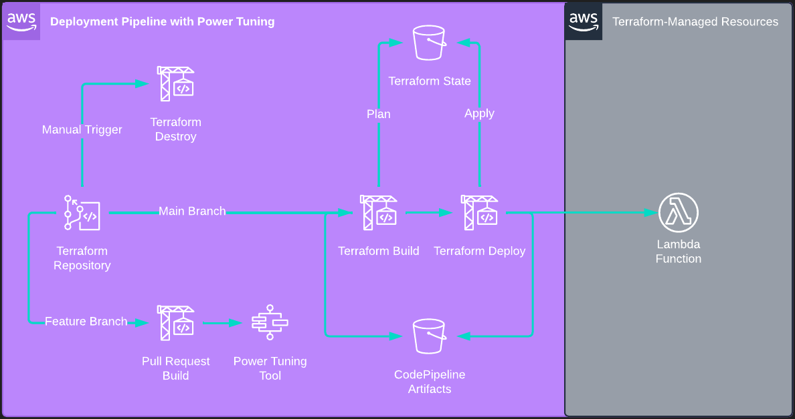

## Solution Overview
As I [wrote about previously](https://scottie.is/writing/cost-conscious-terraform/), AWS users are shifting left on costs using DevOps and automation. While tools like [Infracost](https://www.infracost.io/) are powerful for estimating costs for Lambda and other services, they alone do not provide optimization or tuning feedback during the development lifecycle. This is where a tool like AWS Lambda Power Tuning assists:

> AWS Lambda Power Tuning is an open-source tool that can help you visualize and fine-tune the memory and power configuration of Lambda functions. It runs in your own AWS account, powered by AWS Step Functions, and it supports three optimization strategies: cost, speed, and balanced.

Lambda pricing is determined by the number of invocations and the execution duration. From a cost optimization perspective, there are several strategies for decreasing duration costs including using Graviton for 20% savings (which this solution does for both Lambda and CodeBuild), leveraging the latest runtime versions, taking advantage of execution reuse, etc. In addition to these, optimizing memory allocation is a key mechanism for efficiency. From the [documentation](https://aws.amazon.com/lambda/pricing/):

> The [duration] price depends on the amount of memory you allocate to your function. In the AWS Lambda resource model, you choose the amount of memory you want for your function and are allocated proportional CPU power and other resources. An increase in memory size triggers an equivalent increase in CPU available to your function.

Without running the Lambda function using different configurations, it is unclear what is the most optimal memory amount for cost and/or performance. This solution demonstrates AWS Lambda Tuning Tools integration with a CodeSuite CI/CD pipeline to bring Lambda tuning information to the pull request process and code review discussion. The source code is hosted on [GitHub](https://github.com/scottenriquez/lambda-power-tuned).

## Solution Architecture


This solution deploys several resources:
- The AWS Lambda Power Tuning application
- A CodeCommit repository preloaded with Terraform code for a Lambda function to tune
- A CodeBuild project triggered by pull request state changes that invoke the AWS Lambda Power Tuning state machine
- A CodePipeline with manual approvals to deploy the Terraform for changes pushed to the `main` branch
- An S3 bucket to store Terraform state remotely
- An S3 bucket to store CodePipeline artifacts

## Preparing Your Development Environment
While this solution is for writing and deploying Terraform HCL syntax, I wrote the infrastructure code for the deployment pipeline and dependent resources using AWS CDK, which is my daily driver for infrastructure as code. I intentionally used Terraform for the target Lambda function to clearly differentiate between the code for resources managed by the pipeline and the pipeline itself.

The following dependencies are required to deploy the pipeline infrastructure:

- An AWS account
- Node.js
- Terraform
- [AWS CDK](https://docs.aws.amazon.com/cdk/v2/guide/getting_started.html)
- [Source code](https://github.com/scottenriquez/lambda-power-tuned)

Rather than installing Node.js, CDK, Terraform, and all other dependencies on your local machine, you can alternatively create a [Cloud9 IDE](https://aws.amazon.com/cloud9/) with these pre-installed via the Console or with a CloudFormation template:
```yaml
Resources:
  rCloud9Environment:
    Type: AWS::Cloud9::EnvironmentEC2
    Properties:
      AutomaticStopTimeMinutes: 30
      ConnectionType: CONNECT_SSH 
      Description: Environment for writing and deploying CDK 
      # AWS Free Tier eligible
      InstanceType: t2.micro	
      Name: PowerTuningCDKPipelineCloud9Environment
      # https://docs.aws.amazon.com/cloud9/latest/user-guide/vpc-settings.html#vpc-settings-create-subnet
      SubnetId: subnet-EXAMPLE 
```

## Installation and Deployment
To install and deploy the pipeline, use the following commands:
```shell
git clone https://github.com/scottenriquez/lambda-power-tuned.git
cd lambda-power-tuned
python3 -m venv .venv
. .venv/bin/activate
cd lambda_power_tuned
pip install -r requirements.txt
# https://docs.aws.amazon.com/cdk/v2/guide/bootstrapping.html
cdk bootstrap
cdk deploy
```

## Using the Deployment Pipeline
The CodePipeline pipeline is triggered at creation, but there are manual approval stages to prevent any infrastructure from being created without intervention. Feel free to deploy the Terraform, but it is not required for generating tuning information via a pull request. The CodePipeline is triggered by changes to `main`.


Next, make some code changes to see the performance impact. To modify the Lambda code, either use the CodeCommit GUI in the Console or clone the repository to your development environment. First, create a branch called `feature` off of `main`. Then make some kind of code change, commit to `feature`, and open a pull request. This automatically triggers the build, which does the following:
- Add a comment to the pull request with a hyperlink back to the CodeBuild run
- Initialize Terraform against the deployment state to detail resources changed relative to `main`
- Add a comment to the pull request with the `resource_changes` property from the Terraform plan
- Reinitialize the environment to create a transient deployment of the `feature` branch infrastructure to leverage for tuning purposes
- Generate an input file for AWS Lambda Power Tuning
- Run the `execute-power-tuning.sh` Bash code to invoke the state machine and capture results
- Add a comment to the pull request with a hyperlink to the tuning results for easy consumption


The results are encoded into the query string of the hyperlink, so the tuning results can easily be shared. As shown by the [results of the example function](https://lambda-power-tuning.show/#gAAAAQACAAQ=;AAAAQAAAAEAAAABAAAAAQA==;b6VpMW+l6TFvpWkyb6XpMg==) included in the repository, 128MB is the cheapest configuration.

## Diving Into the Pull Request Build Logic

The Python code for describing the deployment pipeline lives in `power_tuned_lambda_stack.py`. The build logic is spread across the pull request project's `buildspec` and a Bash script residing in the CodeCommit repository. The CodeBuild logic is responsible for creating and destroying the transient testing environment, while the `execute-power-tuning.sh` contains the specific logic needed to tune the target Lambda function(s). The following code snippets (with comments explaining the `build` phase) contain the core logic for integrating AWS Lambda Power Tuning into the pull request:

```python
pull_request_codebuild_project = aws_codebuild.Project(self, 'PullRequestCodeBuildProject',
    build_spec=aws_codebuild.BuildSpec.from_object({
        'version': '0.2',
        'phases': {
            'install': {
                'commands': [
                    'git checkout $CODEBUILD_SOURCE_VERSION',
                    'yum -y install unzip util-linux jq',
                    f'wget https://releases.hashicorp.com/terraform/{terraform_version}/terraform_{terraform_version}_linux_arm64.zip',
                    f'unzip terraform_{terraform_version}_linux_arm64.zip',
                    'mv terraform /usr/local/bin/',
                    'export BUILD_UUID=$(uuidgen)'
                ]
            },
            'build': {
                'commands': [
                    'aws codecommit post-comment-for-pull-request --repository-name $REPOSITORY_NAME --pull-request-id $PULL_REQUEST_ID --content \"The pull request CodeBuild project has been triggered. See the [logs for more details]($CODEBUILD_BUILD_URL).\" --before-commit-id $SOURCE_COMMIT --after-commit-id $DESTINATION_COMMIT',
                    # create plan against the production function (i.e., what is currently in main)
                    f'terraform init -backend-config="bucket={terraform_state_s3_bucket.bucket_name}"',
                    'terraform plan -out tfplan-pr-$BUILD_UUID.out',
                    # format plan output into Markdown
                    'terraform show -json tfplan-pr-$BUILD_UUID.out > plan-$BUILD_UUID.json',
                    'echo "\`\`\`json\n$(cat plan-$BUILD_UUID.json | jq \'.resource_changes\')\n\`\`\`" > plan-formatted-$BUILD_UUID.json',
                    # write plan to the pull request comments
                    # limit to 10,000 bytes to due the CodeCommit limit pull request content
                    'aws codecommit post-comment-for-pull-request --repository-name $REPOSITORY_NAME --pull-request-id $PULL_REQUEST_ID --content \"Terraform resource changes:\n$(cat plan-formatted-$BUILD_UUID.json | head -c 10000)\" --before-commit-id $SOURCE_COMMIT --after-commit-id $DESTINATION_COMMIT',
                    # reinitialize and create a new state file to manage the transient environment for performance tuning
                    f'terraform init -reconfigure -backend-config="bucket={terraform_state_s3_bucket.bucket_name}" -backend-config="key=pr-$BUILD_UUID.tfstate"',
                    'terraform apply -auto-approve',
                    # execute the state machine and get tuning results
                    # defer tuning logic and configuration to the repository for developer customization
                    'sh execute-power-tuning.sh',
                    # destroy transient environment
                    'terraform destroy -auto-approve'
                ]
            }
        }
    }),
    source=aws_codebuild.Source.code_commit(
        repository=lambda_repository),
    badge=True,
    environment=aws_codebuild.BuildEnvironment(
        build_image=aws_codebuild.LinuxBuildImage.AMAZON_LINUX_2_ARM_3,
        environment_variables={
            'REPOSITORY_NAME': aws_codebuild.BuildEnvironmentVariable(
                value=lambda_repository.repository_name),
            'STATE_MACHINE_ARN': aws_codebuild.BuildEnvironmentVariable(
                value=power_tuning_tools_application.get_att('Outputs.StateMachineARN').to_string())
        },
        compute_type=aws_codebuild.ComputeType.SMALL,
        privileged=True
    ),
    role=terraform_apply_codebuild_iam_role)
```

Since the CodeBuild project does not have contextual awareness of what the Terraform HCL in the CodeCommit repository is describing (e.g., how many Lambda functions exist), the developer can implement the tuning logic in `execute-power-tuning.sh`. For this example, this is simply grabbing the Lambda ARN, formatting the AWS Lambda Power Tuning input file, and executing the state machine. However, this logic could be expanded for multiple Lambda functions and other use cases.

```shell
#!/bin/bash
# obtain ARN from Terraform and build input file
TARGET_LAMBDA_ARN=$(terraform output -raw arn)
echo $(jq --arg arn $TARGET_LAMBDA_ARN '. += {"lambdaARN" : $arn}' power-tuning-input.json) > power-tuning-input-$BUILD_UUID.json
POWER_TUNING_INPUT_JSON=$(cat power-tuning-input-$BUILD_UUID.json)
# start execution
EXECUTION_ARN=$(aws stepfunctions start-execution --state-machine-arn $STATE_MACHINE_ARN --input "$POWER_TUNING_INPUT_JSON"  --query 'executionArn' --output text)
echo -n "Execution started..."
# poll execution status until completed
while true;
do
    # retrieve execution status
    STATUS=$(aws stepfunctions describe-execution --execution-arn $EXECUTION_ARN --query 'status' --output text)
    if test "$STATUS" == "RUNNING"; then
        # keep looping and wait if still running
        echo -n "."
        sleep 1
    elif test "$STATUS" == "FAILED"; then
        # exit if failed
        echo -e "\nThe execution failed, you can check the execution logs with the following script:\naws stepfunctions get-execution-history --execution-arn $EXECUTION_ARN"
        break
    else
        # print execution output if succeeded
        echo $STATUS
        echo "Execution output: "
        # retrieve output
        aws stepfunctions describe-execution --execution-arn $EXECUTION_ARN --query 'output' --output text > power-tuning-output-$BUILD_UUID.json
        break
    fi
done
# get output URL and comment on pull request
POWER_TUNING_OUTPUT_URL=$(cat power-tuning-output-$BUILD_UUID.json | jq -r '.stateMachine .visualization')
aws codecommit post-comment-for-pull-request --repository-name $REPOSITORY_NAME --pull-request-id $PULL_REQUEST_ID --content "Lambda tuning is complete. See the [results for full details]($POWER_TUNING_OUTPUT_URL)." --before-commit-id $SOURCE_COMMIT --after-commit-id $DESTINATION_COMMIT
```

Lastly, note that there is an AWS Lambda Power Tuning input file included in the CodeCommit repository that can be modified as well. The `"lambdaARN"` property is excluded because it will be dynamically added by the build for the transient environment. For more details on the input and output configurations, see the [documentation on GitHub](https://github.com/alexcasalboni/aws-lambda-power-tuning/blob/master/README-INPUT-OUTPUT.md).

```json
{
	"powerValues": [
		128,
		256,
		512,
		1024
	],
	"num": 50,
	"payload": {},
	"parallelInvocation": true,
	"strategy": "cost"
}
```

## Cleanup
If you deployed resources via the deployment pipeline, be sure to either use the `DestroyTerraform` CodeBuild project or run:
```shell
# set the bucket name variable or replace with a value
# the bucket name nomenclature is 'terraform-state-' followed by a UUID
# this can also be found via the Console
terraform init -backend-config="bucket=$TERRAFORM_STATE_S3_BUCKET_NAME"
terraform destroy
```

To destroy the pipeline itself run:
```shell
cdk destroy
```

If you spun up a Cloud9 environment, be sure to delete that as well.

## Disclaimer
At the time of writing this blog post, I currently work for Amazon Web Services. The opinions and views expressed here are my own and not the views of my employer.