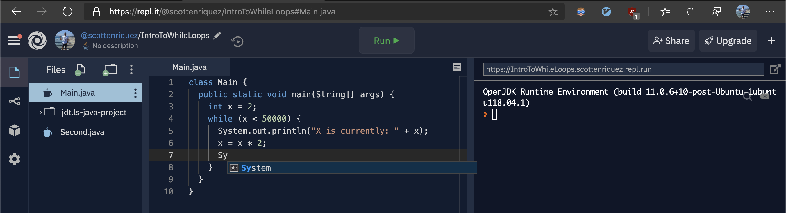

## Background

I co-teach an advanced placement computer science class at Heights High School in Houston with the [TEALS program](https://www.microsoft.com/en-us/teals). The curriculum utilizes the Java programming language and has an emphasis on object-oriented programming. From a school IT system perspective, we have limited options for the software we can distribute to the students' laptops. During my first year of volunteering, we opted to use BlueJ for the first couple of months before exposing them to Eclipse, a more heavy-duty integrated development environment. Both editors have their challenges and limitations for novices, so we began to evaluate several other options, including Visual Studio Code. After considering numerous factors, including the complexity of installation, editor features, and accessibility, we opted to try a radically different option: [Repl.it](http://repl.it/).

## Benefits and Implications

Repl.it is a feature-rich, browser-based IDE with support for numerous programming languages, including Java. In addition to the editor and computing environment, the application supports classroom features such as creating assignments that I will detail further below. Since Repl.it runs in the browser, there's no installation or configuration in terms of editors, runtimes, etc. Using a browser-based tool decreased the number of local support issues that we had to address. We found that students had much fewer problems with getting acclimated to the tooling compared to BlueJ and Eclipse. The user interface proved to be intuitive. There were relatively few issues with the underlying runtimes and virtualization that Repl.it abstracts from the user.



Repl.it requires an internet connection, and teachers shouldn't assume that students have internet access at home. Though many classes will be online due to the COVID-19 global pandemic, keep in mind that students may have limited connectivity. I recommend offering desktop IDEs as an offline alternative so that students can at least run code locally.

## Setting Up a Classroom

Repl.it is free for schools. There's an excellent [video overview of the features on YouTube](https://youtu.be/PYHW-1BlVgc). Last year, we used Repl.it Classroom for assigning coding homework. We use other software like [Practice-It](https://practiceit.cs.washington.edu/) for some assignments but struggled to find a way to evaluate raw source code. Repl.it simplified grading because we didn't have to pull down students' source code and build on our local machines.

## Integrating with GitHub

While Repl.it is excellent for running code and submitting assignments, it doesn't offer built-in source control. Teachers create classrooms on a per year basis, so sharing examples and references across classes isn't transparent. Each environment targets an individual student exercise, so collaboration isn't seamless either.

GitHub offers a public place to store code and implement software development workflows like pull requests and CI/CD. At Heights High School, we've [hosted solutions here](https://github.com/teals-heights-high-school) for students and any other teachers who want to use the code in their classrooms. The source code for this project resides in a public repository as well. Repl.it has native GitHub integration so that a public repository can be imported when creating a new Repl. The Repl syncs with the GitHub repository so that when a developer pushes changes to the remote origin, the updates propagate to Repl.it.

## Creating a Template

With GitHub, a team can create a template project to be used when a new repository is created. Templates allow developers to have codebase structure (i.e., putting source code in `/src`) and configuration files injected into every child repository. Under the repository settings page, check the template repository flag. After this, when creating a new repository, the template should appear as an option for the base.

## Template Project for Repl.it

This [GitHub project](https://github.com/teals-heights-high-school/repl-it-example) contains a template repository.

### `Main.java`

In terms of source code, only the `"Hello, World!"` program is included:

```java
class Main {
    public static void main(String[] args) {
        System.out.println("Hello, world!");
    }
}
```

Given that most assignments fit into a single file, I haven't injected any opinions on the file structure.

### `.editorconfig`

I've included an [EditorConfig](https://editorconfig.org/) file in this project so that the code styling remains consistent across multiple codebases. EditorConfig is IDE-agnostic with plugins or native integration across IntelliJ, Visual Studio Code, Eclipse, etc.

```shell
root = true

[*]
indent_style = tab
end_of_line = lf
charset = utf-8
trim_trailing_whitespace = true
```

### `.replit`

Repl.it supports a configuration file that allows a developer to specify which language and run command to use. Without going into details about the recent changes to Oracle's Java license structure, I'll note that this project uses OpenJDK 10, which is free and open-source. The `run` variable in the configuration file refers to a shell command to compile and execute the program. Bash on the underlying Linux virtual machine interprets the command, so it isn't specific to Repl.it. The run command can be tested on a local computer or by modifying the configuration file directly in Repl.it.

```shell
language = "java10"
run = "javac Main.java && java Main"
```

## Fork the Project

[](https://repl.it/github/teals-heights-high-school/repl-it-example)
