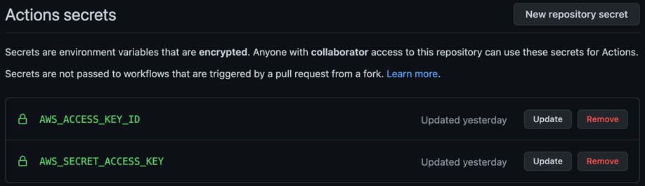

## About AWS SAM Pipelines
Last week, [AWS announced the public preview for SAM Pipelines](https://aws.amazon.com/blogs/compute/introducing-aws-sam-pipelines-automatically-generate-deployment-pipelines-for-serverless-applications/). This feature expands the SAM CLI allowing users to create multi-account CI/CD pipelines for serverless applications quickly across several providers such as GitHub Actions, GitLab CI/CD, and Jenkins. Along with [CDK Pipelines](https://scottie.is/writing/an-api-with-dotnet-lambda/), the AWS tooling keeps making it easier to standardize with best practices.

## Preparing Your Machine 
I opted to create a container image for my Lambda function for my testing, so the core dependencies are the AWS CLI, SAM CLI, and Docker.

```shell
# aws-cli/2.2.23 Python/3.9.6 Darwin/20.6.0 source/x86_64 prompt/off
aws --version
# SAM CLI, version 1.27.2
sam --version 
# Docker version 20.10.7, build f0df350
docker --version
```

## Creating the SAM Application and Pipeline
First, create a starter application. I chose `amazon/nodejs14.x-base` for a base image. Then, run the `pipeline` command with the `--bootstrap` flag to configure the CI/CD provider and requisite AWS resources like IAM policies.

```shell
sam init
sam pipeline init --bootstrap
```

The `pipeline` command walks you through a series of configuration steps. For the CI/CD provider, choose GitHub Actions which is a two-stage pipeline. For each stage, provide the following information:
- Name (i.e., pre-production, production)
- Account details (i.e., access keys provided for AWS CLI)
- Reference application build resources (i.e., pipeline execution role, CloudFormation execution role, S3 bucket for build artifacts, ECR repository for container images)

The pipeline user's access key and secret key will display in the terminal, which will be required for configuring the GitHub Actions. Repeat the steps for the second stage. The CLI creates `.aws-sam/pipeline/pipelineconfig.toml` to store the configuration.

```toml
version = 0.1
[default]
[default.pipeline_bootstrap]
[default.pipeline_bootstrap.parameters]
pipeline_user = "arn:aws:iam::123456789199:user/aws-sam-cli-managed-Pre-production-pi-PipelineUser-CGSL85Y74RRL"

[Pre-production]
[Pre-production.pipeline_bootstrap]
[Pre-production.pipeline_bootstrap.parameters]
pipeline_execution_role = "arn:aws:iam::123456789199:role/aws-sam-cli-managed-Pre-prod-PipelineExecutionRole-HKCRZ2IX8SOY"
cloudformation_execution_role = "arn:aws:iam::123456789199:role/aws-sam-cli-managed-Pre-p-CloudFormationExecutionR-1XKKSR1ZGOTH3"
artifacts_bucket = "aws-sam-cli-managed-pre-productio-artifactsbucket-g2pauw42amc"
image_repository = "123456789199.dkr.ecr.us-east-1.amazonaws.com/aws-sam-cli-managed-pre-production-pipeline-resources-imagerepository-qjnaif21ukb0"
region = "us-east-1"

[Production]
[Production.pipeline_bootstrap]
[Production.pipeline_bootstrap.parameters]
pipeline_execution_role = "arn:aws:iam::123456789199:role/aws-sam-cli-managed-Producti-PipelineExecutionRole-1ANR2SNKQD638"
cloudformation_execution_role = "arn:aws:iam::123456789199:role/aws-sam-cli-managed-Produ-CloudFormationExecutionR-17RL86055A01I"
artifacts_bucket = "aws-sam-cli-managed-production-pi-artifactsbucket-177nd7ab4h4bz"
image_repository = "123456789199.dkr.ecr.us-east-1.amazonaws.com/aws-sam-cli-managed-production-pipeline-resources-imagerepository-nhdrmzfnssnr"
region = "us-east-1"
```

The CLI will prompt you for the secret name to use for the IAM pipeline user in GitHub Actions (i.e., `${{ secrets.AWS_ACCESS_KEY_ID }}` instead of a hardcoded value). These credentials should never be exposed in the source code. `pipeline.yaml` is created in the `.github/workflows` folder.

```yaml
name: Pipeline

on:
  push:
    branches:
      - 'main'
      - 'feature**'

env:
  PIPELINE_USER_ACCESS_KEY_ID: ${{ secrets.AWS_ACCESS_KEY_ID }}
  PIPELINE_USER_SECRET_ACCESS_KEY: ${{ secrets.AWS_SECRET_ACCESS_KEY }}
  SAM_TEMPLATE: sam-pipelines-app/template.yaml
  TESTING_STACK_NAME: sam-pipelines-app
  TESTING_PIPELINE_EXECUTION_ROLE: arn:aws:iam::123456789199:role/aws-sam-cli-managed-Pre-prod-PipelineExecutionRole-HKCRZ2IX8SOY
  TESTING_CLOUDFORMATION_EXECUTION_ROLE: arn:aws:iam::123456789199:role/aws-sam-cli-managed-Pre-p-CloudFormationExecutionR-1XKKSR1ZGOTH3
  TESTING_ARTIFACTS_BUCKET: aws-sam-cli-managed-pre-productio-artifactsbucket-g2pauw42amc
  TESTING_IMAGE_REPOSITORY: 123456789199.dkr.ecr.us-east-1.amazonaws.com/aws-sam-cli-managed-pre-production-pipeline-resources-imagerepository-qjnaif21ukb0
  TESTING_REGION: us-east-1
  PROD_STACK_NAME: sam-pipelines-app
  PROD_PIPELINE_EXECUTION_ROLE: arn:aws:iam::123456789199:role/aws-sam-cli-managed-Producti-PipelineExecutionRole-1ANR2SNKQD638
  PROD_CLOUDFORMATION_EXECUTION_ROLE: arn:aws:iam::123456789199:role/aws-sam-cli-managed-Produ-CloudFormationExecutionR-17RL86055A01I
  PROD_ARTIFACTS_BUCKET: aws-sam-cli-managed-production-pi-artifactsbucket-177nd7ab4h4bz
  PROD_IMAGE_REPOSITORY: 123456789199.dkr.ecr.us-east-1.amazonaws.com/aws-sam-cli-managed-production-pipeline-resources-imagerepository-nhdrmzfnssnr
  PROD_REGION: us-east-1

jobs:
  test:
    runs-on: ubuntu-latest
    steps:
      - uses: actions/checkout@v2
      - run: |
          # trigger the tests here

  build-and-deploy-feature:
    ...

  build-and-package:
    ...

  deploy-testing:
    ...

  integration-test:
    ... 

  deploy-prod:
    ...
```

Before pushing the changes to the remote origin, add the IAM pipeline user credentials as secrets in GitHub.



## Adding Approvers
The default pipeline does not have any approval mechanisms in place, so when pushing to `main`, the application goes directly to production. To add approvers, create [an environment](https://docs.github.com/en/actions/reference/environments#creating-an-environment) in GitHub and add approvers. Then, reference the environment in the pipeline YAML.

```yaml
deploy-prod:
    if: github.ref == 'refs/heads/main'
    needs: [integration-test]
    runs-on: ubuntu-latest
    environment: production
```

## Feature Branch Environments
For [feature branches](https://www.atlassian.com/git/tutorials/comparing-workflows/gitflow-workflow) (i.e., named `feature*`), the pipeline will create a new CloudFormation stack and deploy the branch automatically. This is powerful for quickly testing in a live environment outside of the two stages created by the pipeline.


Note that there is no functionality in the default pipeline to delete the CloudFormation stack when the feature branch is deleted.