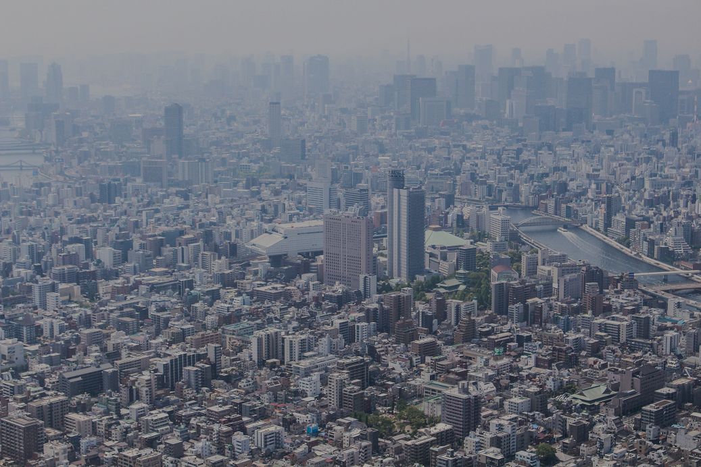
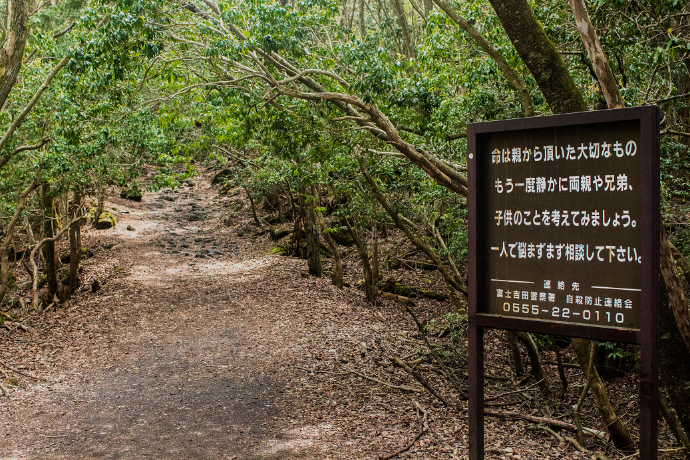
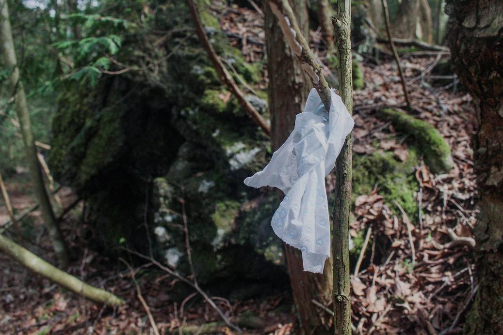

import getGoogleMapsAPIKey from '../../../../src/services/googleMapsAPIKeyService'
import getGoogleMapsOptionsSettings from '../../../../src/services/googleMapsOptionsService'
import GoogleMapReact from 'google-map-react'
import MapMarker from '../../../../src/components/mapMarker'

# April 30th, 2016 - 電車の風 - Tokyo

    <GoogleMapReact
        bootstrapURLKeys={{ key: getGoogleMapsAPIKey() }}
        defaultCenter={{lat: 35.772230, lng: 140.392904}}
        defaultZoom={7}
        options={getGoogleMapsOptionsSettings()}
    >
    <MapMarker lat={35.772230} lng={140.392904} />
    </GoogleMapReact>

 

As expected, Kaylee and I arrived at Narita Airport in Japan extremely jet-lagged. Even though I was lucky enough to have only one connecting flight in Chicago, the 18 or so hours of travel and 14-hour time difference took their toll on me both mentally and physically.

Kyle, my close friend from college who lives in Tokyo, greeted us right outside of customs after we landed. We exchanged our「お久しぶりですね」 greetings and headed towards the train station. It never ceases to amaze me how Kyle and I are always able to just pick up where we left off. Even though I hadn't seen him in over a year, it felt like our conversation only had a momentary pause. The dumb running jokes and philosophical life conversations seem to run forever in a loop like the train that we were about to board.

We all purchased our tickets and awaited the Skyliner express train. Right on schedule I was greeted with a brisk gust of wind displaced by the arriving train. It immediately woke me from my exhaustion-induced fog and gave me the strangest sense of déjà vu. Moments like these always come off like a cheap movie transition, but it truly felt like the past year had gone by in instant and that I had only been gone from Tokyo for a few days. Winds from trains are always one of the first images of Japan that come to my mind. It's a perfect mixture of the natural imagery of traditional Japanese culture and technology that's prevalent in the sprawling metropolises like Tokyo.

# May 1st, 2016 - Nooks and Crannies - Tokyo

    <GoogleMapReact
        bootstrapURLKeys={{ key: getGoogleMapsAPIKey() }}
        defaultCenter={{lat: 35.710324, lng: 139.810657}}
        defaultZoom={9}
        options={getGoogleMapsOptionsSettings()}
    >
    <MapMarker lat={35.710324} lng={139.810657} />
    </GoogleMapReact>

 

For my second journey to the land of the rising sun, I opted to see more of the country and spend less time in Tokyo. Don’t get me wrong, Tokyo natives can go their whole lives without seeing all that the metropolis has to offer, but there’s even more to see across the countryside. However, we thought it would be a good idea to schedule a day in Tokyo early on in the trip to get our bearings and get acclimated to all of the changes. I highly recommend this for anyone who plans on traveling within Japan.

We first travelled from where we were staying in Waseda to Sumida to see the legendary Tokyo Skytree Tower. The tower stands at approximately 650 meters tall making it the tallest structure in Japan and the second tallest structure in the entire world. While it is somewhat of a tourist trap, the view from Tembo Deck shows the massive sprawl of the largest metropolitan area in the world. 13.5 million people, about 1.5 times as many as New York City, live in Tokyo below. From approximately 450 meters up through a panoramic window, you can see how the iron and concrete seem to consume the earth in every direction for as far as the eye can see.

It’s a view with a surreal amount of detail. There seem to be an infinite number of nooks and crannies that house culture, shops, universities, parks, and libraries. When traveling throughout Tokyo, it’s easy to be shielded from the overwhelming logistics of a city that size. Given how advanced the subway system is, it’s very easy to abstractly move from district to district in your mind without fully appreciating the absolute chaos that surrounds you.

That’s not to say that you're never exposed to copious amount of people. From Sumida we travelled to Taito to see the famous Senso-ji. Near this Buddhist temple is a market that sells everything from homemade food to souvenirs geared towards English-speaking tourists. It was some of the most organized havoc that I had ever seen. People were packed tightly together and slowly moving forward through the human congestion. The notion of personal space did not exist there. Even though I’m well over six feet tall and could breathe freely above the mob, I still felt like I was suffocating. I thought back to how peaceful everything looked from the Skytree Tower earlier in the day. My view now was quite different in many ways.

# May 2nd, 2016 - Sea of Trees - Aokigahara

    <GoogleMapReact
        bootstrapURLKeys={{ key: getGoogleMapsAPIKey() }}
        defaultCenter={{lat: 35.491928, lng: 138.682636}}
        defaultZoom={7}
        options={getGoogleMapsOptionsSettings()}
    >
    <MapMarker lat={35.491928} lng={138.682636} />
    </GoogleMapReact>

 

Aokigahara is without question the ultimate symbol for life and death. Known as the Sea of Trees, it's a dense forest in front of Mount Fuji where many have committed suicide. The forest came to be upon the cooled lava from a 10-day eruption in the year 864. From death comes life, I suppose. The origin of Aokigahara as the so-called Suicide Forest isn’t exactly clear. Some attribute its morbidity to ubasute which is the practice of abandoning elders to die in times of famine. Some credit the forest’s popularity in recent years to a novel called Kuroi Jukai published in 1960. In any case, since the early 2000s alone, there have been hundreds of suicides and many more attempts.

Despite the unchecked growth of the forest, it has a sense of rot to it. Many trees have greedily drained the nutrients out of the soil leaving their roots exposed and frail. There's also some notable parasitic plants that feed and grow on one another. A sense of stillness is the only thing that seems to permeate the thick foliage of the towering trees. Some light and most wind was blocked by the upper layers of leaves, leaving many parts dimly lit with the sound of leaves rustling and no breeze for hikers to feel. It's quite easy to get lost and perish in the wilderness, and there are many warning signs not to deviate from the trails for this reason.

I knew of the forest from [a documentary that I saw on YouTube](https://www.youtube.com/watch?v=4FDSdg09df8) when I was a college student. I distinctly remembered a chilling sign beckoning those contemplating suicide to reconsider, but did not know its exact location nor could I find very much detail on the internet. Due to some logistical issues, I was unable to see the forest for myself during my first trip to Japan last year. This time I wanted to make sure that I had the opportunity to.

The three of us took trains for about an hour from Waseda in Tokyo to Fujikawaguchiko, a small town just north of Fuji. From Fujikawaguchiko, we plotted our trip to Aokigahara. We explored the area while asking minimal questions about the location of the forest to avoid attention from the locals. When asking for a map of the area from a guide, he seemed puzzled as to why we wanted to go to the forest specifically. There are numerous tourist attractions in the area, so I told the guide that we were interested in them as to not bring any attention to ourselves. He told us about the caves and other sights and pointed us to the correct bus. We rode the bus for about thrity minutes or so through the town and surrounding area until one of the last stops. There were countless breathtaking views of green mountains circling a peaceful lake.

While searching for the sign, we enjoyed all of the activities that Aokigahara has to offer: hiking through serene trails and crouching through caves. After a bit more research, we eventually found out that the trail with the anti-suicide sign was supposed to be located somewhere near the so-called Ice Cave. As it turned out, this cave is an attraction with many visitors. It seemed hard to believe that something so depressing and morose would be near a bunch of families posing in front of natural wonders. Sure enough, just behind the gift shop was a trail leading back into the forest. A short way into the the path, there it was.

「命は親から頂いた大切なもの。もう一度静かに両親や兄弟、子供のことを考えてみましょう。一人で悩まずまず相談してください。」

"Life is a precious gift from your parents. Quietly think once more about your parents, siblings, and children. Don’t keep this to yourself; please discuss this with someone."

At this point, the mood changed amongst the three of us. A certain gravity weighed down upon us knowing that hundreds of people had entered this path never to leave. We decided to enter this final trail and see what we'd find. Despite the fact that a hundred or so vacationing tourists were right outside the trail, their voices seemed to fade almost immediately behind the thickage. We walked through this trail much more slowly than the others we had walked before earlier in the day. Our conversation had died out as well and the only thing that was to be heard was the sound of leaves rustling many meters above us.

We didn't really know what lied ahead, but I felt this strange compulsion to continue going further into the forest. We had the map of the area, but this particular path was an easily missed gray line at the bottom that ran off the page. This trail looked very similar to the others at first, but it quickly became noticably darker. Kaylee found a laminated card with what we assumed to be a faded religious figure and a phone number for a suicide hotline. We saw many signs warning us to stay on the main path, but eventually I saw one that stuck out to me from the Vice documentary.

The already somber mood became sobering. The stillness somehow became even more still. We decided to leave the main path, but not to stray too far. It would be very possible to unintentionally die in the forest if we wandered far from the path and couldn't find our way back. "Well, we came all this way," I remember saying.

At first, we walked as far was we could with the sign that said no entry still in sight. That's when I saw the first tissue. My heart sank and the experience became even more real. It was a clear marker for navigating back to the main path. I examined the tissue and saw that it was light blue with what looked like hearts printed on it. It was very feminine. Immediately, I was already making deductions about the personality of whoever left it there. I thought about how they had the same idea we did about finding our way back out of the forest. It had been raining every day that week in the area prior to our arrival, so we knew that it was recently tied otherwise it would have disintegrated. The fact that this person used a flimsy tissue instead of a sturdy line or ribbon suggested that this person was not an experienced hiker.

We decided to follow the tissues. Honestly, I hadn't taken into consideration what I would have done if I found the person on the other end, but we pressed on. At first the tissues were in very rapid succession. Then they became more sparse. Eventually, the trail began to rise much more steeply and dissipate, and I didn't find any more tissues. I scouted ahead a bit, asking my companions to stay back at the last tissue, but I didn't find anything. Without food or rope to mark our way back, we decided to leave the forest. I'd like to think that the person turned around and left the forest, but we'll never know.

# May 3rd, 2016 - Change of Pace - Chiba

    <GoogleMapReact
        bootstrapURLKeys={{ key: getGoogleMapsAPIKey() }}
        defaultCenter={{lat: 35.644085, lng: 140.04023}}
        defaultZoom={7}
        options={getGoogleMapsOptionsSettings()}
    >
    <MapMarker lat={35.644085} lng={140.04023} />
    </GoogleMapReact>

 

After an extremely emotional day in Aokigahara, a light-hearted day in Chiba was more than welcome. The three of us attended Japan Jam Beach, an annual all-day rock music festival. Chiba-shi, which sits on Tokyo Bay, reminds me a lot of the San Francisco Bay Area. Most of Chiba gave me a California vibe as well.

I had the pleasure of seeing two of my favorite bands that I frequently listened to during my university days when I first started studying Japanese: The Back Horn and the world-famous Asian Kung-Fu Generation. Even though the three of us attended the same music festival when in Japan last year, I can’t even begin to put into words how it felt to enjoy the bands in person whose lyrics I spent hours translating with one of my closest friends. Back then, seeing Japan was just a distant dream that filled the spaces in between my classes. To be there on the beach just felt like anything is possible.

# May 4th-5th, 2016 - The Old City - Kyoto

    <GoogleMapReact
        bootstrapURLKeys={{ key: getGoogleMapsAPIKey() }}
        defaultCenter={{lat: 35.012881, lng: 135.677749}}
        defaultZoom={8}
        options={getGoogleMapsOptionsSettings()}
    >
    <MapMarker lat={35.012881} lng={135.677749} />
    </GoogleMapReact>

 

Vacation usually implies a sense of relaxation, but at this point in the trip we were all already exhausted. The past two days had been a blur of trains, buses, and walking everywhere. Each day had been filled with hours of transit, constant motion, and a draining mixture of emotions. It didn’t help that Japan doesn’t observe Daylight Savings Time like the US does. Sunlight flooded our little Tokyo apartment around five every morning, and it affected my sleeping patterns greatly. I remember waking up constantly, and I couldn’t help but think back to the midnight sun from when I lived in Alaska.

This day we had to wake up even earlier than five in the morning. After getting back to Tokyo around 11 the previous night, we were too exhausted to pack for our trip to Kyoto and Okinawa after that. The bullet train to Kyoto was going to leave at 6:25 with or without us, so we quickly packed a small bag and headed to Tokyo Station. We cut it quite close and the doors closed a couple minutes after we sat down.

It’s about a three-hour ride on the train from Tokyo to Kyoto. Kyle and Kaylee quickly drifted off, but I still couldn't sleep. Despite the fact that we were heading west on the main island at about 200 miles per hour, it was an incredibly smooth ride. The only evidence of how fast we were really going was the blurred rice fields outside my window. We arrived in Kyoto right on time later in the morning, and I was already exhausted by then.

It was extremely difficult to keep up the pace at which we were traveling at for such a prolonged time, but we had very limited time in Kyoto so we pressed on. We arrived at Kyoto Station with nothing planned for the next day and a half. After walking around the massive station, which feels more like a shopping mall, for a while, we acquired a map of the area and decided to head to Nijo Castle. The bus that we rode to the castle must have had fifty tourists inside. It was by far the most cramped that I was during the entire trip.

The castle itself was absolutely beautiful. At nearly 400-years-old, you can smell the history. Inside, there were numerous paintings and other prominent pieces of artwork from the era. There was also a serene garden in the courtyard area. It always humbles me to be in a place that has already existed much longer than I will.

After visiting the castle, we took the Sagano Line to Arashiyama. This is where we spent most of the day. Kyoto was the capital of Japan long before Tokyo and has an extremely rich cultural history. Because of this, Kyoto is very popular amongst tourists all over the world. Due to its accessibility and absolutely gorgeous scenery, Arashiyama especially caters to tourists. There’s a main street in front of the famous Togetsukyo Bridge which houses many shops and restaurants. It was a welcomed reprieve to relax in this area and enjoy the natural beauty of the surrounding mountains and the wide Katsura River.

The last activity we enjoyed in the Arashiyama District was the Iwatayama Monkey Park. It was a bit of a hike up to the top, but the scenery was simply breathtaking. In addition to the monkeys, at the peak is a beautiful view of the city. It’s nowhere near as sprawling as Tokyo, but there’s still a lot to appreciate. I personally enjoyed the views here more because of the nature that seems to seamlessly blend into the city.

After Arashiyama, we decided to head to our ryokan, a traditional Japanese inn, which was located near Kyoto Station. After a few blunders with slippers, we made it to our room and everyone sprawled out on their tatami mats. Despite all of the traditional culture around us, we grabbed McDonald’s for dinner and turned in early for the night.

The next day was mostly reserved for traveling. From Kyoto Station, we went to Kansai Airport to fly to Okinawa for the next few days. It’s about an hour and a half train ride to the artificial island in Osaka Bay where the airport is located. From Kansai, we had a two-hour flight to the Pacific island of Okinawa.

# May 5th-8th, 2016 - Texas in the Pacific - Okinawa

    <GoogleMapReact
        bootstrapURLKeys={{ key: getGoogleMapsAPIKey() }}
        defaultCenter={{lat: 26.699348, lng: 127.902083}}
        defaultZoom={7}
        options={getGoogleMapsOptionsSettings()}
    >
    <MapMarker lat={26.699348} lng={127.902083} />
    </GoogleMapReact>

 

Immediately upon landing in Okinawa the differences from mainland Japan became extremely apparent. Tokyo and to some extent Kyoto as well seemed very focused on appearance. Tokyo is a global fashion hub and home to many corporate employees. It was rare to see someone who wasn’t well-dressed. Waiting in the small Naha Airport, I couldn’t help but compare it to sprawling Narita Airport in Tokyo.

After leaving the airport, we hailed a taxi that looked fresh out of a 1980s film. It was an antique Toyota whose model I’m sure was never sold in the United States. The interior was a grey, worn fabric that was equally as dated. The driver was dressed like a retired person in Florida. I immediately realized that unlike the metropolises of mainland Japan, life in Okinawa would be nearly impossible without a car. After about 20 minutes, we arrived at our Western style hotel in Naha. From our window we could see how everything in Okinawa looked aged: buildings, cars, and style. The best explanation that we could come up with was that it’s probably very expensive to import goods to the island.

Admittedly, I wasn’t sure that I was going to like Okinawa at first. Tokyo, which has a modern New York City vibe to it, had so many sights and splendor, but Okinawa just seemed somewhat dilapidated and retro. After a quick shower and nap, we headed to dinner at a nearby restaurant. I knew as soon as we walked in that it was going to be one of my favorite experiences of the trip.

We couldn’t really hear anything from outside, but we were greeted with to the loud, melodic sounds of taiko and shamisen, traditional Japanese instruments, as we walked in. It was an interactive experience. People were swaying, clapping, and singing proudly. The first page of the menu featured the lyrics for the songs. A little infant girl was the life of the party. She stumbled around the restaurant laughing and clapping. Audience participation was required.

The barrage on my senses was a little overwhelming at first. We were meeting up with some mutual friends from Tokyo who we would be spending the remainder of the trip with, and I was trying to focus on getting everyone introduced. However, the conversation, food, alcohol, singing, and dancing all flowed naturally throughout the night. Our table was a constant mixture of Japanese and English used interchangeably. Several sake-fueled Snapchats were sent.

Getting the exposure to native speakers was amazing Japanese practice and equally amazing to see how far my skills have come over the years. During an intermission, the man singing and playing the shamisen asked who had come to Okinawa from the furthest place. Someone from the audience proudly proclaimed that he had come all the way from Hokkaido. The shamisen player looked towards our table and made a comment about how the foreigners probably came from far away as well. He switched to broken English and asked where we had come from. I replied to him in Japanese that we had come from America to visit my friend who I studied Japanese in college with but now lives in Tokyo. He made a joke about how my Japanese was much better than his English and resumed the music. For the rest of the night, I was approached by several Japanese people who wanted to ask me random questions about my studies and why I came to Okinawa.

The next morning our new friends picked us up in a rental car. They introduced us to some of their friends that live in Okinawa. One of them is a diver and works at the military base. He was kind enough to bring us on the base as his guests, and we were able to enjoy beautiful White Beach all by ourselves. We even were allowed to use their equipment freely. It was the kind of hospitality that you feel like you can never fully repay. We spent all day on the base and left sunburned all over our bodies.

Our new friends found us a house with a private beach to stay at. Honestly, the view looked like something off of a heavily Photoshopped postcard. I had never seen anything like it before. After dinner, we all laid on the beach together and stargazed beneath a clear sky miles and miles away from any light pollution.

We woke the next day sore and stiff. Our bodies were red and blistering from the Pacific sun. We decided to take it easy the next day and explore Motobu. We hiked along the beach, had lunch at a cafe with a breathtaking view of the blue water, and even went to the famous aquarium. That night our gracious hosts even cooked for us, and we taught each other drinking games from our respective cultures.

In Okinawa, life is very simple. Everyone dresses, speaks, and acts very casually. In Tokyo, people seemed to use set, polite phrases when talking to each other. My conversations in Okinawa were much more down-to-earth and personal. Some of which would probably have even been considered rude in Tokyo. There were also some small differences in dialect. For example, when saying welcome, which is said「ようこそ」 in the Tokyo dialect, they instead use 「めんそーれ」. Okinawa wasn’t always a part of Japan either, and at times, it felt like a completely different country. All of these factors combined reminded me a lot of my home state of Texas.

Leaving Okinawa and our new friends was one of the saddest moments of the trip for me, but I’m truly grateful for every amazing experience that I had there and the people who made it possible.

# May 8th-10th, 2016 - Hard Goodbyes - Tokyo
A seven-hour delay in Naha Airport threw off our plans for the remainder of the trip. We arrived back in Tokyo much later than we had planned and had to sprint to catch the last Skyliner train at 10:30pm. We didn’t make it back to the apartment until midnight and promptly crashed from exhaustion after the last leg of our trip. We originally had plans to go to Hakone the following day, but decided to rest before our long flight back to the United States.

We hung around Shinjuku most of the day instead and ended up eating Domino’s pizza and watching Big Daddy on Netflix for our last night. It was raining all day which made for a very somber departure. Kyle asked me if it would be a while before I came back to Japan again. I told them that coming twice in two years was a lot already. It made me very sad to think about not being back for some time, so I guess I have no choice but to go back next year again even if only for a shorter time.