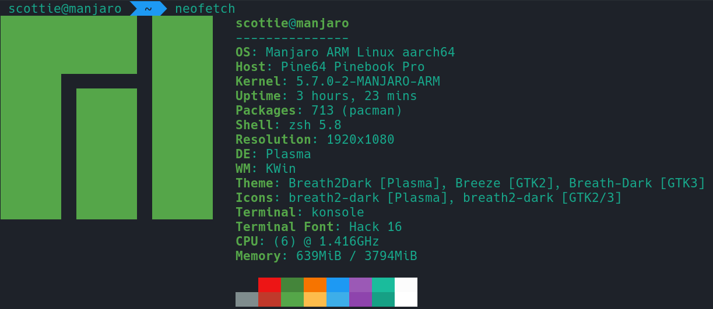

# About the PINEBOOK Pro
Here's an overview of the specs:
- Rockchip RK3399 SOC with Mali T860 MP4 GPU
- 4GB LPDDR4 RAM
- 1080p IPS Panel
- 64GB of eMMC
- Lithium Polymer Battery (10000mAH)
- WiFi 802.11 AC + Bluetooth 5.0
- Front-Facing Camera (1080p)

The laptop ships by default with Manjaro KDE for the operating system:
